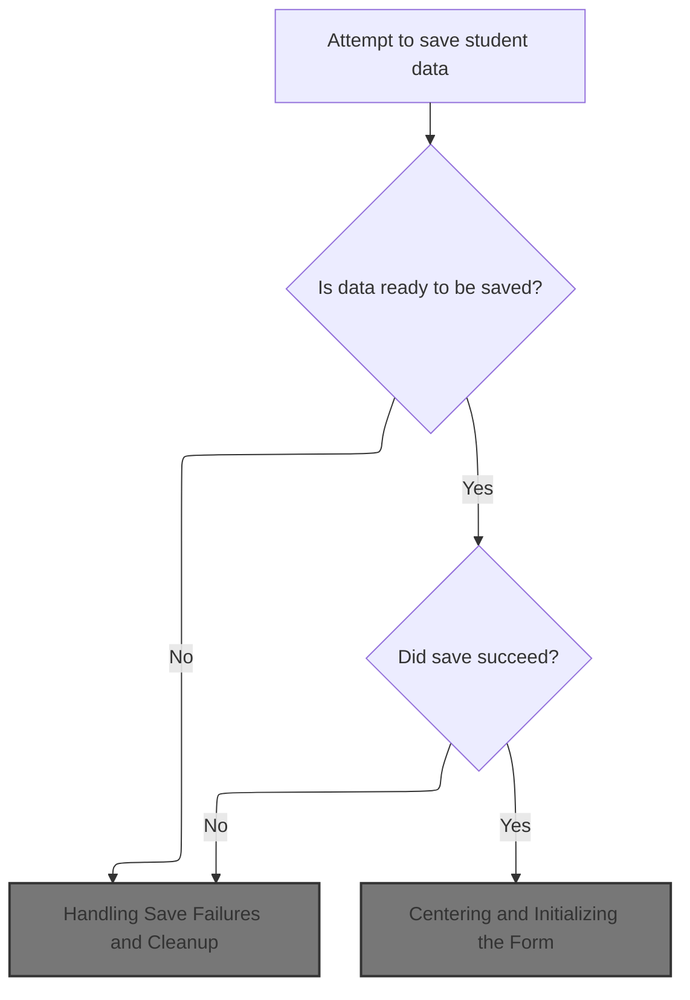
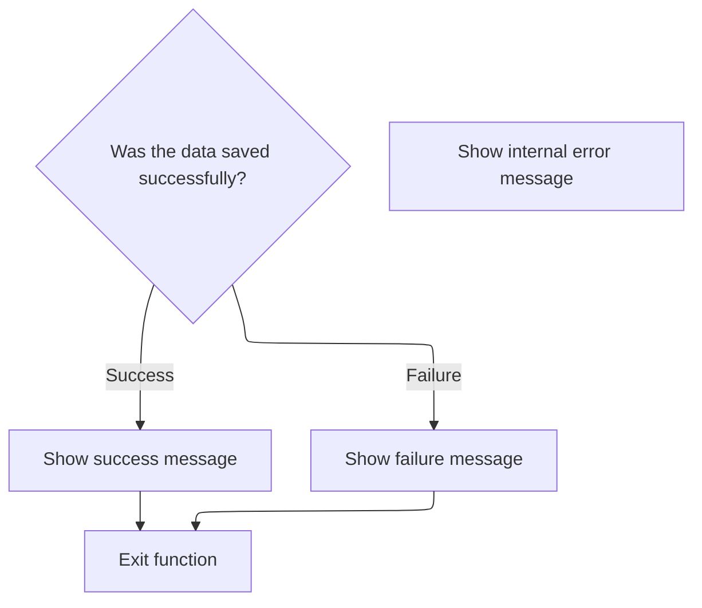

This document outlines the flow for saving student data via the entry form. The system checks for class selection, processes the save, and prepares the form for the next entry by clearing fields and refreshing the class list.

# Validating Class Selection and Triggering Save

<SwmSnippet path="/BK App/Form/frmentrysiswa.frm" line="2129">

---

In <SwmToken path="BK App/Form/frmentrysiswa.frm" pos="2129:4:4" line-data="Private Sub Command2_Click()">`Command2_Click`</SwmToken>, we check if the user has picked a class. If not, we bail out with a message. If a class is selected, we move on to <SwmToken path="BK App/Form/frmentrysiswa.frm" pos="2134:1:1" line-data="        mnuSave">`mnuSave`</SwmToken> to actually process and save the student data.

```visual basic
Private Sub Command2_Click()
    If Combo1.text = "" Then
        MsgBox "Kelas Siswa Belum Dipilih", vbInformation
        Exit Sub
    Else
        mnuSave
```

---

</SwmSnippet>

## Preparing and Saving Student Data



<SwmSnippet path="/BK App/Form/frmentrysiswa.frm" line="1969">

---

In <SwmToken path="BK App/Form/frmentrysiswa.frm" pos="1969:4:4" line-data="Private Sub mnuSave()">`mnuSave`</SwmToken>, we set the gender based on the checkbox, block saving if the form is empty or unchanged, then call <SwmToken path="BK App/Form/frmentrysiswa.frm" pos="1984:2:2" line-data="If SaveData(txtnis.text, &quot;&quot; &amp; txtnamasiswa.text, &quot;&quot; &amp; txttempatlahir.text, _">`SaveData`</SwmToken> with all the student info. <SwmToken path="BK App/Form/frmentrysiswa.frm" pos="1984:2:2" line-data="If SaveData(txtnis.text, &quot;&quot; &amp; txtnamasiswa.text, &quot;&quot; &amp; txttempatlahir.text, _">`SaveData`</SwmToken> is next because that's where the actual DB write happens.

```visual basic
Private Sub mnuSave()
Dim jeniskelamin As String
 If txtcew.Value = True Then
    jeniskelamin = "P"
 Else
    jeniskelamin = "L"
 End If
On Error GoTo Hell
If DataMode = EN_NEW Then
    MsgBox "Data harus diisi dulu" & vbCrLf & "Simpan data dibatalkan", vbExclamation, "Simpan Data"
    Exit Sub
ElseIf DataMode = EN_SAVED Then
    MsgBox "Tidak ada data yang berubah" & vbCrLf & "Simpan data dibatalkan", vbExclamation, "Simpan Data"
    Exit Sub
End If
If SaveData(txtnis.text, "" & txtnamasiswa.text, "" & txttempatlahir.text, _
txttgllahir.Value, "" & jeniskelamin, "" & txtagama.text, "" & txtalamatsiswa.text, _
"" & txtnotelpsiswa.text, "" & txtnamaortu.text, "" & txthubungan.text, "" & txtagamaortu.text, _
"" & txtalamatortu.text, "" & txtpendidikanortu.text, "" & txtpekerjaanortu.text, "" & txtsd.text, _
"" & txtalamatsd.text, "" & txtsmp.text, "" & txtalamatsmp.text, "" & txtnonformal1.text, _
"" & txtalamatnonformal1.text, "" & txtnonformal2.text, "" & txtalamatnonformal2.text, _
"" & txtprestasi1.text, "" & txtprestasi2.text, "" & txtprestasi3.text, "" & txtprestasi4.text, _
"" & txtprestasi5.text, "" & txtkegiatan1.text, "" & txtkegiatan2.text, "" & txtkegiatan3.text, _
0 & txtanakke.text, 0 & txtjumlahsaudara.text, 0 & txtjumlahsaudarakandung.text, _
0 & txtjumlahsaudaratiri.text, 0 & txtberatbadan.text, 0 & txttinggibadan.text, _
0 & txtpenyakit1.text, 0 & txtpenyakit2.text, 0 & txtpenyakit3.text) = 1 Then
```

---

</SwmSnippet>

<SwmSnippet path="/BK App/Form/frmentrysiswa.frm" line="2007">

---

<SwmToken path="BK App/Form/frmentrysiswa.frm" pos="2007:4:4" line-data="Private Function SaveData(NIS As Long, Nama As String, _">`SaveData`</SwmToken> either adds or updates a student record depending on <SwmToken path="BK App/Form/frmentrysiswa.frm" pos="2018:2:2" line-data="If DataMode = EN_NEW_CHANGED Then">`DataMode`</SwmToken>. It pushes all the form data to <SwmToken path="BK App/Form/frmentrysiswa.frm" pos="2019:1:1" line-data="    oSiswa.Add NIS, Nama, Tempatlahir, tgllahir, jk, agama, Alamat, Notelp, namaortu, hubungan, agamaortu, alamatortu, pendidikanortu, pekerjaanortu, sd, alamatsd, smp, alamatsmp, nonformalsatu, alamatnonformalsatu, nonformaldua, alamatnonformaldua, prestasi, prestasidua, prestasitiga, prestasiempat, prestasilima, kegiatan, kegiatan1, kegiatan2, anakke, jumlahsaudara, saudarakandung, saudaratiri, beratbadan, tinggibandan, penyakit1, penyakit2, penyakit3, IDD">`oSiswa`</SwmToken>, then marks the data as saved.

```visual basic
Private Function SaveData(NIS As Long, Nama As String, _
Tempatlahir As String, tgllahir As Date, jk As String, agama As String, Alamat As String, Notelp As String, _
namaortu As String, hubungan As String, agamaortu As String, alamatortu As String, pendidikanortu As String, pekerjaanortu As String, _
sd As String, alamatsd As String, smp As String, alamatsmp As String, _
nonformalsatu As String, alamatnonformalsatu As String, nonformaldua As String, _
alamatnonformaldua As String, _
prestasi As String, prestasidua As String, prestasitiga As String, prestasiempat As String, _
prestasilima As String, kegiatan As String, kegiatan1 As String, kegiatan2 As String, anakke As Integer, _
jumlahsaudara As Integer, saudarakandung As Integer, saudaratiri As Integer, beratbadan As Integer, tinggibandan As Integer, penyakit1 As String, _
penyakit2 As String, penyakit3 As String, IDKelas As Integer) As Integer

If DataMode = EN_NEW_CHANGED Then
    oSiswa.Add NIS, Nama, Tempatlahir, tgllahir, jk, agama, Alamat, Notelp, namaortu, hubungan, agamaortu, alamatortu, pendidikanortu, pekerjaanortu, sd, alamatsd, smp, alamatsmp, nonformalsatu, alamatnonformalsatu, nonformaldua, alamatnonformaldua, prestasi, prestasidua, prestasitiga, prestasiempat, prestasilima, kegiatan, kegiatan1, kegiatan2, anakke, jumlahsaudara, saudarakandung, saudaratiri, beratbadan, tinggibandan, penyakit1, penyakit2, penyakit3, IDD
ElseIf DataMode = EN_LOAD_CHANGED Then
    oSiswa.Edit NIS, Nama, Tempatlahir, tgllahir, jk, agama, Alamat, Notelp, namaortu, hubungan, agamaortu, alamatortu, pendidikanortu, pekerjaanortu, sd, alamatsd, smp, alamatsmp, nonformalsatu, alamatnonformalsatu, nonformaldua, alamatnonformaldua, prestasi, prestasidua, prestasitiga, prestasiempat, prestasilima, kegiatan, kegiatan1, kegiatan2, anakke, jumlahsaudara, saudarakandung, saudaratiri, beratbadan, tinggibandan, penyakit1, penyakit2, penyakit3, IDD
End If
DataMode = EN_SAVED
SaveData = 1

End Function
```

---

</SwmSnippet>

<SwmSnippet path="/BK App/Form/frmentrysiswa.frm" line="1995">

---

Back in <SwmToken path="BK App/Form/frmentrysiswa.frm" pos="1969:4:4" line-data="Private Sub mnuSave()">`mnuSave`</SwmToken>, after a successful save, we show a confirmation and call <SwmToken path="BK App/Form/frmentrysiswa.frm" pos="1997:3:3" line-data="    Call New_data">`New_data`</SwmToken> to clear the form for the next input.

```visual basic
    
    MsgBox "Data BERHASIL disimpan", vbInformation, "Simpan Data"
    Call New_data
```

---

</SwmSnippet>

### Resetting Form and Populating Class List

<SwmSnippet path="/BK App/Form/frmentrysiswa.frm" line="2082">

---

In <SwmToken path="BK App/Form/frmentrysiswa.frm" pos="2082:4:4" line-data="Private Sub New_data()">`New_data`</SwmToken>, we set up the form for a new entry and call <SwmToken path="BK App/Form/frmentrysiswa.frm" pos="2084:3:3" line-data="    Call IsiCombo(PidTahun)">`IsiCombo`</SwmToken> to reload the class list, so the <SwmToken path="BK App/Form/frmentrysiswa.frm" pos="180:5:5" line-data="         Begin VB.ComboBox Combo1 ">`ComboBox`</SwmToken> always has the latest options.

```visual basic
Private Sub New_data()
    DataMode = EN_NEW
    Call IsiCombo(PidTahun)
```

---

</SwmSnippet>

<SwmSnippet path="/BK App/Form/frmentrysiswa.frm" line="2312">

---

<SwmToken path="BK App/Form/frmentrysiswa.frm" pos="2312:4:4" line-data="Private Sub IsiCombo(PidTahun As Integer)">`IsiCombo`</SwmToken> grabs all classes for the current academic year and fills the <SwmToken path="BK App/Form/frmentrysiswa.frm" pos="180:5:5" line-data="         Begin VB.ComboBox Combo1 ">`ComboBox`</SwmToken> with 'Class-Room' strings for user selection.

```visual basic
Private Sub IsiCombo(PidTahun As Integer)
Dim rsss As New ADODB.Recordset
    Set rsss = Nothing
    rsss.CursorLocation = adUseClient
        Set rsss = oKelas.ListCombo("where IDTahunAjaran = " & PidTahun & "")
        For i = 0 To rsss.RecordCount - 1
            Combo1.AddItem rsss!Kelas & "-" & rsss!Ruangan
            rsss.MoveNext
        Next
End Sub
```

---

</SwmSnippet>

<SwmSnippet path="/BK App/Form/frmentrysiswa.frm" line="2085">

---

Back in <SwmToken path="BK App/Form/frmentrysiswa.frm" pos="1997:3:3" line-data="    Call New_data">`New_data`</SwmToken>, after updating the <SwmToken path="BK App/Form/frmentrysiswa.frm" pos="180:5:5" line-data="         Begin VB.ComboBox Combo1 ">`ComboBox`</SwmToken>, we clear all input fields and set the birth date to now, so the form is clean for the next entry.

```visual basic
    txtalamatnonformal1.text = ""
    txtalamatnonformal2.text = ""
    txtalamatortu.text = ""
    txtalamatsd.text = ""
    txtalamatsiswa.text = ""
    txtalamatsmp.text = ""
    txtanakke.text = ""
    txtberatbadan.text = ""
    txtcew.Value = False
    txthubungan.text = ""
    txtjumlahsaudara.text = ""
    txtjumlahsaudarakandung.text = ""
    txtjumlahsaudaratiri.text = ""
    txtkegiatan1.text = ""
    txtkegiatan2.text = ""
    txtkegiatan3.text = ""
    txtlaki.Value = False
    txtnamaortu.text = ""
    txtnamasiswa.text = ""
    txtnis.text = ""
    txtnonformal1.text = ""
    txtnonformal2.text = ""
    txtnotelpsiswa.text = ""
    txtpekerjaanortu.text = ""
    txtpendidikanortu.text = ""
    txtpenyakit1.text = ""
    txtpenyakit2.text = ""
    txtpenyakit3.text = ""
    txtprestasi1.text = ""
    txtprestasi2.text = ""
    txtprestasi3.text = ""
    txtprestasi4.text = ""
    txtprestasi5.text = ""
    txtsd.text = ""
    txtsmp.text = ""
    txttempatlahir.text = ""
    txttgllahir.Value = Now
    txttinggibadan.text = ""
End Sub
```

---

</SwmSnippet>

### Reloading Form State

<SwmSnippet path="/BK App/Form/frmentrysiswa.frm" line="1998">

---

Back in <SwmToken path="BK App/Form/frmentrysiswa.frm" pos="1969:4:4" line-data="Private Sub mnuSave()">`mnuSave`</SwmToken>, after clearing the form, we call <SwmToken path="BK App/Form/frmentrysiswa.frm" pos="1998:1:1" line-data="    Form_Load">`Form_Load`</SwmToken> to reinitialize the form and make sure everything is in a known state.

```visual basic
    Form_Load
```

---

</SwmSnippet>

### Centering and Initializing the Form

<SwmSnippet path="/BK App/Form/frmentrysiswa.frm" line="2142">

---

In <SwmToken path="BK App/Form/frmentrysiswa.frm" pos="2142:4:4" line-data="Private Sub Form_Load()">`Form_Load`</SwmToken>, we center the form on the screen using <SwmToken path="BK App/Form/frmentrysiswa.frm" pos="2143:3:3" line-data="    Call form_ditengah(Index, Me)">`form_ditengah`</SwmToken> so the UI always appears in the same spot.

```visual basic
Private Sub Form_Load()
    Call form_ditengah(Index, Me)
```

---

</SwmSnippet>

<SwmSnippet path="/BK App/Modul/Module1.bas" line="44">

---

<SwmToken path="BK App/Modul/Module1.bas" pos="44:4:4" line-data="Public Function form_ditengah(ByVal Index As MDIForm, ByVal child As Form)">`form_ditengah`</SwmToken> centers the child form in the parent, but bumps it up by 500 units, likely to avoid UI clutter at the bottom.

```visual basic
Public Function form_ditengah(ByVal Index As MDIForm, ByVal child As Form)
    Dim kiri As Integer
    Dim atas As Integer
    kiri = (Index.Width - child.Width) / 2
    atas = (Index.Height - child.Height) / 2 - 500
    child.Left = kiri
    child.Top = atas
End Function
```

---

</SwmSnippet>

<SwmSnippet path="/BK App/Form/frmentrysiswa.frm" line="2144">

---

Back in <SwmToken path="BK App/Form/frmentrysiswa.frm" pos="1998:1:1" line-data="    Form_Load">`Form_Load`</SwmToken>, after centering, we call <SwmToken path="BK App/Form/frmentrysiswa.frm" pos="2144:3:3" line-data="    Call New_data">`New_data`</SwmToken> to reset all fields and prep for new input.

```visual basic
    Call New_data
```

---

</SwmSnippet>

<SwmSnippet path="/BK App/Form/frmentrysiswa.frm" line="2145">

---

Back in <SwmToken path="BK App/Form/frmentrysiswa.frm" pos="1998:1:1" line-data="    Form_Load">`Form_Load`</SwmToken>, after resetting the form, we create new instances of the student and class data handlers so everything is fresh.

```visual basic
    Set oSiswa = New DLLBK.Csiswa
    Set oKelas = New DLLBK.Ckelas
End Sub
```

---

</SwmSnippet>

### Handling Save Failures and Cleanup



<SwmSnippet path="/BK App/Form/frmentrysiswa.frm" line="1999">

---

Back in <SwmToken path="BK App/Form/frmentrysiswa.frm" pos="1969:4:4" line-data="Private Sub mnuSave()">`mnuSave`</SwmToken>, if <SwmToken path="BK App/Form/frmentrysiswa.frm" pos="1984:2:2" line-data="If SaveData(txtnis.text, &quot;&quot; &amp; txtnamasiswa.text, &quot;&quot; &amp; txttempatlahir.text, _">`SaveData`</SwmToken> fails, we show an error message and exit, so the user knows something went wrong and can try again.

```visual basic
Else
    MsgBox "Data GAGAL disimpan", vbCritical, "Simpan Data"
End If
Exit Sub
Hell:
    MsgBox Err.Description, vbCritical, "Internal"
    'Resume Next
End Sub
```

---

</SwmSnippet>

## Wrapping Up the Save Action

<SwmSnippet path="/BK App/Form/frmentrysiswa.frm" line="2135">

---

Back in <SwmToken path="BK App/Form/frmentrysiswa.frm" pos="2129:4:4" line-data="Private Sub Command2_Click()">`Command2_Click`</SwmToken>, after <SwmToken path="BK App/Form/frmentrysiswa.frm" pos="1969:4:4" line-data="Private Sub mnuSave()">`mnuSave`</SwmToken> runs, we just exit, leaving the UI ready for whatever the user wants to do next.

```visual basic
    End If
End Sub
```

---

</SwmSnippet>

&nbsp;

*This is an auto-generated document by Swimm 🌊 and has not yet been verified by a human*

<SwmMeta version="3.0.0" repo-id="Z2l0aHViJTNBJTNBY3RzLVZCNi1Qcm9qZWN0cyUzQSUzQVN3aW1tLURlbW8=" repo-name="cts-VB6-Projects"><sup>Powered by [Swimm](https://app.swimm.io/)</sup></SwmMeta>
