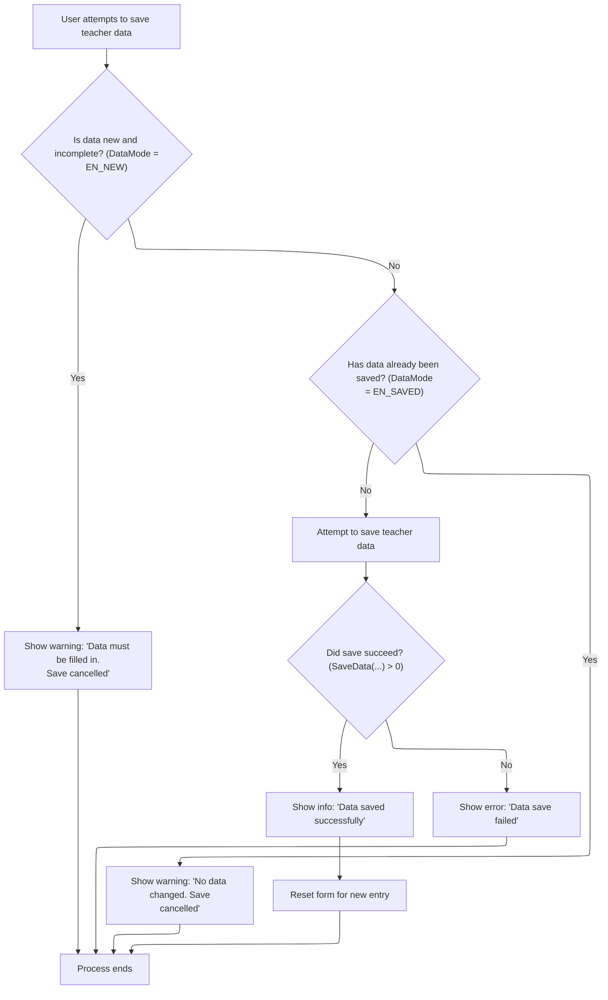

This document describes how users save teacher data in the teacher management interface. When a user initiates a save, the system validates the data and determines if saving is allowed. If successful, the user receives a confirmation and the form is reset for new entry. If not, the user is informed with a warning or error message.

# Triggering the Save Action

<SwmSnippet path="/BK App/Form/frmguru.frm" line="219">

---

In <SwmToken path="BK App/Form/frmguru.frm" pos="219:4:4" line-data="Private Sub Command3_Click()">`Command3_Click`</SwmToken>, the only thing happening is a direct call to <SwmToken path="BK App/Form/frmguru.frm" pos="220:3:3" line-data="    Call mnuSave">`mnuSave`</SwmToken>. This means clicking the button hands off all logic to <SwmToken path="BK App/Form/frmguru.frm" pos="220:3:3" line-data="    Call mnuSave">`mnuSave`</SwmToken>, so nothing else is handled here. We call <SwmToken path="BK App/Form/frmguru.frm" pos="220:3:3" line-data="    Call mnuSave">`mnuSave`</SwmToken> next because that's where all the actual save logic and checks are centralized.

```visual basic
Private Sub Command3_Click()
    Call mnuSave
```

---

</SwmSnippet>

## Validating and Processing the Save



<SwmSnippet path="/BK App/Form/frmguru.frm" line="227">

---

In <SwmToken path="BK App/Form/frmguru.frm" pos="227:4:4" line-data="Private Sub mnuSave()">`mnuSave`</SwmToken>, we first check <SwmToken path="BK App/Form/frmguru.frm" pos="229:2:2" line-data="If DataMode = EN_NEW Then">`DataMode`</SwmToken> to see if saving makes sense—if the form is empty or unchanged, we bail out with a message. If saving is allowed, we call <SwmToken path="BK App/Form/frmguru.frm" pos="236:2:2" line-data="If SaveData(&quot;&quot; &amp; txtnip.text, &quot;&quot; &amp; txtnama.text, &quot;&quot; &amp; txtalamat.text, &quot;&quot; &amp; txtjabatan.text) &gt; 0 Then">`SaveData`</SwmToken> to actually write the data, since that's where the add/edit happens.

```visual basic
Private Sub mnuSave()
On Error GoTo Hell
If DataMode = EN_NEW Then
    MsgBox "Data harus diisi dulu" & vbCrLf & "Simpan data dibatalkan", vbExclamation, "Simpan Data"
    Exit Sub
ElseIf DataMode = EN_SAVED Then
    MsgBox "Tidak ada data yang berubah" & vbCrLf & "Simpan data dibatalkan", vbExclamation, "Simpan Data"
    Exit Sub
End If
If SaveData("" & txtnip.text, "" & txtnama.text, "" & txtalamat.text, "" & txtjabatan.text) > 0 Then
```

---

</SwmSnippet>

<SwmSnippet path="/BK App/Form/frmguru.frm" line="247">

---

<SwmToken path="BK App/Form/frmguru.frm" pos="247:4:4" line-data="Private Function SaveData(pNIP As String, pNama As String, pAlamat As String, pJabatan As String) As Integer">`SaveData`</SwmToken> checks <SwmToken path="BK App/Form/frmguru.frm" pos="248:2:2" line-data="If DataMode = EN_NEW_CHANGED Then">`DataMode`</SwmToken> to decide if we're adding or editing a record via <SwmToken path="BK App/Form/frmguru.frm" pos="249:1:1" line-data="    oGuru.Add pNIP, pNama, pAlamat, pJabatan">`oGuru`</SwmToken>, then marks the data as saved. It always returns 1 to signal success back to <SwmToken path="BK App/Form/frmguru.frm" pos="220:3:3" line-data="    Call mnuSave">`mnuSave`</SwmToken>.

```visual basic
Private Function SaveData(pNIP As String, pNama As String, pAlamat As String, pJabatan As String) As Integer
If DataMode = EN_NEW_CHANGED Then
    oGuru.Add pNIP, pNama, pAlamat, pJabatan
ElseIf DataMode = EN_LOAD_CHANGED Then
    oGuru.Edit pNIP, pNama, pAlamat, pJabatan
End If
DataMode = EN_SAVED
SaveData = 1
End Function
```

---

</SwmSnippet>

<SwmSnippet path="/BK App/Form/frmguru.frm" line="237">

---

Back in <SwmToken path="BK App/Form/frmguru.frm" pos="220:3:3" line-data="    Call mnuSave">`mnuSave`</SwmToken>, after <SwmToken path="BK App/Form/frmguru.frm" pos="236:2:2" line-data="If SaveData(&quot;&quot; &amp; txtnip.text, &quot;&quot; &amp; txtnama.text, &quot;&quot; &amp; txtalamat.text, &quot;&quot; &amp; txtjabatan.text) &gt; 0 Then">`SaveData`</SwmToken> returns success, we show a confirmation message and call <SwmToken path="BK App/Form/frmguru.frm" pos="238:3:3" line-data="    Call New_data">`New_data`</SwmToken> to clear the form and prep for the next entry.

```visual basic
    MsgBox "Data BERHASIL disimpan", vbInformation, "Simpan Data"
    Call New_data
```

---

</SwmSnippet>

<SwmSnippet path="/BK App/Form/frmguru.frm" line="257">

---

<SwmToken path="BK App/Form/frmguru.frm" pos="257:4:4" line-data="Private Sub New_data()">`New_data`</SwmToken> resets the form by clearing all input fields, sets <SwmToken path="BK App/Form/frmguru.frm" pos="259:1:1" line-data="    DataMode = EN_NEW">`DataMode`</SwmToken> to <SwmToken path="BK App/Form/frmguru.frm" pos="259:5:5" line-data="    DataMode = EN_NEW">`EN_NEW`</SwmToken>, and puts the cursor in txtnip so the user can start typing a new entry immediately.

```visual basic
Private Sub New_data()
    On Error Resume Next
    DataMode = EN_NEW
    txtalamat.text = ""
    txtnama.text = ""
    txtnip.text = ""
    txtjabatan.text = ""
    txtnip.SetFocus
End Sub
```

---

</SwmSnippet>

<SwmSnippet path="/BK App/Form/frmguru.frm" line="239">

---

Back in <SwmToken path="BK App/Form/frmguru.frm" pos="220:3:3" line-data="    Call mnuSave">`mnuSave`</SwmToken>, if <SwmToken path="BK App/Form/frmguru.frm" pos="236:2:2" line-data="If SaveData(&quot;&quot; &amp; txtnip.text, &quot;&quot; &amp; txtnama.text, &quot;&quot; &amp; txtalamat.text, &quot;&quot; &amp; txtjabatan.text) &gt; 0 Then">`SaveData`</SwmToken> fails, we show an error message instead of resetting the form. Either way, the function exits, and any unexpected errors are caught and displayed.

```visual basic
Else
    MsgBox "Data GAGAL disimpan", vbCritical, "Simpan Data"
End If
Exit Sub
Hell:
    MsgBox Err.Description, vbCritical, "Internal"
    'Resume Next
End Sub
```

---

</SwmSnippet>

## Completing the Save Trigger

<SwmSnippet path="/BK App/Form/frmguru.frm" line="221">

---

Finally, after <SwmToken path="BK App/Form/frmguru.frm" pos="220:3:3" line-data="    Call mnuSave">`mnuSave`</SwmToken> finishes, <SwmToken path="BK App/Form/frmguru.frm" pos="219:4:4" line-data="Private Sub Command3_Click()">`Command3_Click`</SwmToken> just ends. All user feedback and state changes are handled in <SwmToken path="BK App/Form/frmguru.frm" pos="220:3:3" line-data="    Call mnuSave">`mnuSave`</SwmToken>, so nothing else happens here.

```visual basic
End Sub
```

---

</SwmSnippet>

&nbsp;

*This is an auto-generated document by Swimm 🌊 and has not yet been verified by a human*

<SwmMeta version="3.0.0" repo-id="Z2l0aHViJTNBJTNBY3RzLVZCNi1Qcm9qZWN0cyUzQSUzQVN3aW1tLURlbW8=" repo-name="cts-VB6-Projects"><sup>Powered by [Swimm](https://app.swimm.io/)</sup></SwmMeta>
