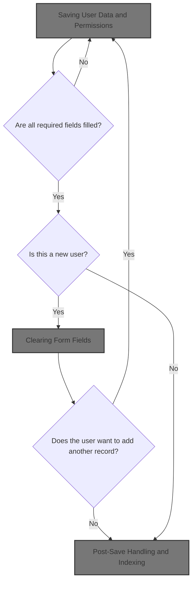
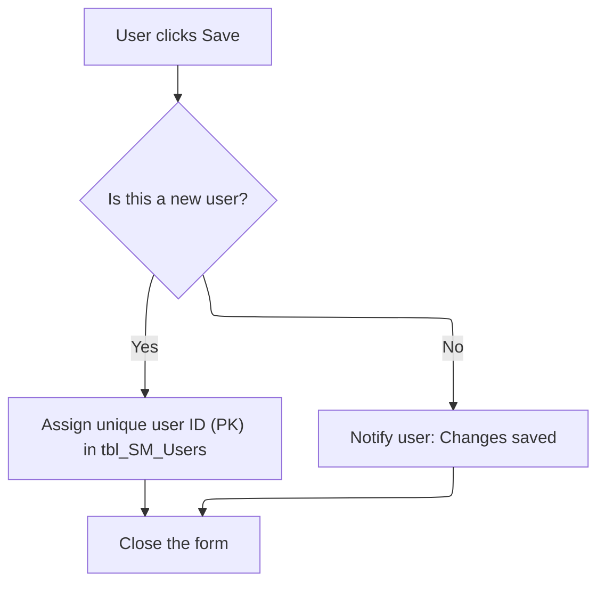

This document outlines how user data and permissions are saved in the user management interface. When the Save button is clicked, the system validates required fields, determines whether to add or update a user, assigns permissions for new users, encrypts the password, and converts admin status. After saving, the user is notified and can either add another user or close the form.



# Saving User Data and Permissions

<SwmSnippet path="/HotelManagementSystem/Forms/frmUsers.frm" line="162">

---

In <SwmToken path="HotelManagementSystem/Forms/frmUsers.frm" pos="162:4:4" line-data="Private Sub cmdSave_Click()">`cmdSave_Click`</SwmToken>, we start by validating that all required text fields are filled. If any are empty, we exit early. Then, we check if we're adding or editing: in add mode, we prep the new record with PK, <SwmToken path="HotelManagementSystem/Forms/frmUsers.frm" pos="170:6:6" line-data="        RS.Fields(&quot;DateAdded&quot;) = Now">`DateAdded`</SwmToken>, and <SwmToken path="HotelManagementSystem/Forms/frmUsers.frm" pos="171:6:6" line-data="        RS.Fields(&quot;AddedByFK&quot;) = CurrUser.USER_PK">`AddedByFK`</SwmToken>, and in edit mode, we update <SwmToken path="HotelManagementSystem/Forms/frmUsers.frm" pos="175:6:6" line-data="        RS.Fields(&quot;DateModified&quot;) = Now">`DateModified`</SwmToken> and <SwmToken path="HotelManagementSystem/Forms/frmUsers.frm" pos="176:6:6" line-data="        RS.Fields(&quot;LastUserFK&quot;) = CurrUser.USER_PK">`LastUserFK`</SwmToken>. We need to call <SwmPath>[HotelManagementSystem/Modules/modFunction.bas](HotelManagementSystem/Modules/modFunction.bas)</SwmPath> next to run the <SwmToken path="HotelManagementSystem/Forms/frmUsers.frm" pos="163:3:3" line-data="    If is_empty(txtEntry(0), True) = True Then Exit Sub">`is_empty`</SwmToken> checks for each field, which handles the validation and user prompts.

```visual basic
Private Sub cmdSave_Click()
    If is_empty(txtEntry(0), True) = True Then Exit Sub
    If is_empty(txtEntry(1), True) = True Then Exit Sub
    If is_empty(txtEntry(2), True) = True Then Exit Sub
    
    If State = adStateAddMode Then
        RS.AddNew
        RS.Fields("PK") = PK
        RS.Fields("DateAdded") = Now
        RS.Fields("AddedByFK") = CurrUser.USER_PK
        
```

---

</SwmSnippet>

<SwmSnippet path="/HotelManagementSystem/Modules/modFunction.bas" line="122">

---

<SwmToken path="HotelManagementSystem/Modules/modFunction.bas" pos="122:4:4" line-data="Public Function is_empty(ByRef sText As Variant, Optional UseTagValue As Boolean) As Boolean">`is_empty`</SwmToken> checks if a textbox is empty. If it is, it shows a warning (using the Tag property if requested), sets focus back to the field, and returns True. Otherwise, it returns False. This prevents moving forward with missing required data.

```visual basic
Public Function is_empty(ByRef sText As Variant, Optional UseTagValue As Boolean) As Boolean
    On Error Resume Next
    If sText.Text = "" Then
        is_empty = True
        If UseTagValue = True Then
            MsgBox "The field '" & sText.Tag & "' is required.Please check it!", vbExclamation
        Else
            MsgBox "The field is required.Please check it!", vbExclamation
        End If
        sText.SetFocus
    Else
        is_empty = False
    End If
End Function
```

---

</SwmSnippet>

<SwmSnippet path="/HotelManagementSystem/Forms/frmUsers.frm" line="173">

---

Back in <SwmToken path="HotelManagementSystem/Forms/frmUsers.frm" pos="162:4:4" line-data="Private Sub cmdSave_Click()">`cmdSave_Click`</SwmToken>, after validating fields, if we're adding a user, we set up the new record and call <SwmToken path="HotelManagementSystem/Forms/frmUsers.frm" pos="173:3:3" line-data="        Call AddPermission">`AddPermission`</SwmToken> to initialize permissions for the new user. If editing, we just update modification info. <SwmToken path="HotelManagementSystem/Forms/frmUsers.frm" pos="173:3:3" line-data="        Call AddPermission">`AddPermission`</SwmToken> is only needed for new users to set up their default permissions.

```visual basic
        Call AddPermission
    Else
        RS.Fields("DateModified") = Now
        RS.Fields("LastUserFK") = CurrUser.USER_PK
    End If
```

---

</SwmSnippet>

<SwmSnippet path="/HotelManagementSystem/Forms/frmUsers.frm" line="257">

---

<SwmToken path="HotelManagementSystem/Forms/frmUsers.frm" pos="257:4:4" line-data="Public Sub AddPermission()">`AddPermission`</SwmToken> builds and runs an SQL statement that gives the new user access to every form in the system by inserting a permission record for each <SwmToken path="HotelManagementSystem/Forms/frmUsers.frm" pos="262:21:21" line-data="    sSQL = &quot;INSERT INTO [User Permission] ( UserID, FormID ) &quot; _">`FormID`</SwmToken>. This sets up baseline access for the user.

```visual basic
Public Sub AddPermission()
    
    Dim vRS As New ADODB.Recordset
    Dim sSQL As String
    
    sSQL = "INSERT INTO [User Permission] ( UserID, FormID ) " _
            & "SELECT '" & Me.txtEntry(0).Text & "', Form.FormID " _
            & "FROM Form"

    CN.Execute sSQL
    
    Exit Sub
    
RAE:
    Set vRS = Nothing
End Sub
```

---

</SwmSnippet>

<SwmSnippet path="/HotelManagementSystem/Forms/frmUsers.frm" line="178">

---

Back in <SwmToken path="HotelManagementSystem/Forms/frmUsers.frm" pos="162:4:4" line-data="Private Sub cmdSave_Click()">`cmdSave_Click`</SwmToken> after <SwmToken path="HotelManagementSystem/Forms/frmUsers.frm" pos="173:3:3" line-data="        Call AddPermission">`AddPermission`</SwmToken>, we fill the recordset with user data, encrypt the password, and convert the admin checkbox to 'Y' or 'N' using <SwmToken path="HotelManagementSystem/Forms/frmUsers.frm" pos="183:11:11" line-data="        .Fields(&quot;Admin&quot;) = changeYNValue(Check1.Value)">`changeYNValue`</SwmToken>. Then we update the recordset, set <SwmToken path="HotelManagementSystem/Forms/frmUsers.frm" pos="187:1:1" line-data="    HaveAction = True">`HaveAction`</SwmToken>, and handle post-save UI: either reset for another entry or close the form. We call <SwmPath>[HotelManagementSystem/Modules/modFunction.bas](HotelManagementSystem/Modules/modFunction.bas)</SwmPath> next to handle the checkbox value conversion.

```visual basic
    'Phill 2:12
    With RS
        .Fields("UserID") = txtEntry(0).Text
        .Fields("Password") = Enc.EncryptString(txtEntry(1).Text)
        .Fields("CompleteName") = txtEntry(2).Text
        .Fields("Admin") = changeYNValue(Check1.Value)
        .Update
    End With
    
    HaveAction = True
    
    If State = adStateAddMode Then
        MsgBox "New record has been successfully saved.", vbInformation
        If MsgBox("Do you want to add another new record?", vbQuestion + vbYesNo) = vbYes Then
```

---

</SwmSnippet>

<SwmSnippet path="/HotelManagementSystem/Modules/modFunction.bas" line="138">

---

<SwmToken path="HotelManagementSystem/Modules/modFunction.bas" pos="138:4:4" line-data="Public Function changeYNValue(ByVal srcStr As String) As String">`changeYNValue`</SwmToken> swaps between 'Y'/'N' and '1'/'0' for boolean fields. This keeps the data format consistent between the UI and the database.

```visual basic
Public Function changeYNValue(ByVal srcStr As String) As String
    Select Case srcStr
        Case "Y": changeYNValue = "1"
        Case "N": changeYNValue = "0"
        Case "1": changeYNValue = "Y"
        Case "0": changeYNValue = "N"
    End Select
End Function
```

---

</SwmSnippet>

<SwmSnippet path="/HotelManagementSystem/Forms/frmUsers.frm" line="192">

---

Back in <SwmToken path="HotelManagementSystem/Forms/frmUsers.frm" pos="162:4:4" line-data="Private Sub cmdSave_Click()">`cmdSave_Click`</SwmToken>, after saving and confirming, if the user wants to add another record, we call <SwmToken path="HotelManagementSystem/Forms/frmUsers.frm" pos="192:1:1" line-data="            ResetFields">`ResetFields`</SwmToken> to clear the form and get it ready for new input.

```visual basic
            ResetFields
```

---

</SwmSnippet>

## Clearing Form Fields

<SwmSnippet path="/HotelManagementSystem/Forms/frmUsers.frm" line="156">

---

<SwmToken path="HotelManagementSystem/Forms/frmUsers.frm" pos="156:4:4" line-data="Private Sub ResetFields()">`ResetFields`</SwmToken> clears all textboxes, unchecks the admin box, and puts focus on the first field. We call <SwmPath>[HotelManagementSystem/Modules/modProcedure.bas](HotelManagementSystem/Modules/modProcedure.bas)</SwmPath> next to actually clear the textboxes.

```visual basic
Private Sub ResetFields()
    clearText Me
    Check1.Value = 0
    txtEntry(0).SetFocus
End Sub
```

---

</SwmSnippet>

<SwmSnippet path="/HotelManagementSystem/Modules/modProcedure.bas" line="228">

---

<SwmToken path="HotelManagementSystem/Modules/modProcedure.bas" pos="228:4:4" line-data="Public Sub clearText(ByRef sForm As Form)">`clearText`</SwmToken> loops through all controls on the form and blanks out any textboxes. Other controls are ignored.

```visual basic
Public Sub clearText(ByRef sForm As Form)
    Dim Control As Control
    For Each Control In sForm.Controls
        If (TypeOf Control Is TextBox) Then Control = vbNullString
    Next Control
    Set Control = Nothing
End Sub
```

---

</SwmSnippet>

## Post-Save Handling and Indexing



<SwmSnippet path="/HotelManagementSystem/Forms/frmUsers.frm" line="193">

---

Back in <SwmToken path="HotelManagementSystem/Forms/frmUsers.frm" pos="162:4:4" line-data="Private Sub cmdSave_Click()">`cmdSave_Click`</SwmToken>, after clearing the form, if the user wants to add another record, we call <SwmToken path="HotelManagementSystem/Forms/frmUsers.frm" pos="193:5:5" line-data="            PK = getIndex(&quot;tbl_SM_Users&quot;)">`getIndex`</SwmToken> from <SwmPath>[HotelManagementSystem/Modules/modADO.bas](HotelManagementSystem/Modules/modADO.bas)</SwmPath> to fetch a new PK for the next user. Otherwise, we just close the form.

```visual basic
            PK = getIndex("tbl_SM_Users")
         Else
            Unload Me
        End If
    Else
        MsgBox "Changes in  record has been successfully saved.", vbInformation
        Unload Me
    End If
End Sub
```

---

</SwmSnippet>

<SwmSnippet path="/HotelManagementSystem/Modules/modADO.bas" line="35">

---

<SwmToken path="HotelManagementSystem/Modules/modADO.bas" pos="35:4:4" line-data="Public Function getIndex(ByVal srcTable As String) As Long">`getIndex`</SwmToken> grabs the next available key for a table from the KEY GENERATOR table, bumps it up by one, and returns the old value. This keeps user IDs unique and sequential.

```visual basic
Public Function getIndex(ByVal srcTable As String) As Long
    On Error GoTo err
    Dim RS As New Recordset
    Dim RI As Long
    
    RS.CursorLocation = adUseClient
    RS.Open "SELECT * FROM [KEY GENERATOR] WHERE TableName = '" & srcTable & "'", CN, adOpenStatic, adLockOptimistic
    
    RI = RS.Fields("NextNo")
    CN.BeginTrans
    RS.Fields("NextNo") = RI + 1
    RS.Update
    CN.CommitTrans
    getIndex = RI
    
    srcTable = ""
    RI = 0
    Set RS = Nothing
    Exit Function
err:
        ''Error when incounter a null value
        If err.Number = 94 Then
            getIndex = 1
            Resume Next
        Else
            MsgBox err.Description
        End If
        CN.RollbackTrans
End Function
```

---

</SwmSnippet>

&nbsp;

*This is an auto-generated document by Swimm 🌊 and has not yet been verified by a human*

<SwmMeta version="3.0.0" repo-id="Z2l0aHViJTNBJTNBY3RzLVZCNi1Qcm9qZWN0cyUzQSUzQVN3aW1tLURlbW8=" repo-name="cts-VB6-Projects"><sup>Powered by [Swimm](https://app.swimm.io/)</sup></SwmMeta>
