This document describes the startup flow initiated by the splash screen timer. After the timer triggers, the application loads essential databases, refreshes computer statuses, and prepares the main UI for user interaction.

# Splash Timer Trigger

<SwmSnippet path="/Internet Cafe System/sErVere/frmSplash.frm" line="322">

---

In <SwmToken path="Internet Cafe System/sErVere/frmSplash.frm" pos="322:4:4" line-data="Private Sub Timer1_Timer()">`Timer1_Timer`</SwmToken>, we stop the timer so it doesn't fire again, then immediately jump into the main application logic by calling Main. This hands off control from the splash screen to the core startup sequence.

```visual basic
Private Sub Timer1_Timer()
  Timer1.Enabled = False
  Main
```

---

</SwmSnippet>

## Startup and Database Prep

<SwmSnippet path="/Internet Cafe System/sErVere/Module1.bas" line="159">

---

In <SwmToken path="Internet Cafe System/sErVere/Module1.bas" pos="159:2:2" line-data="Sub Main()">`Main`</SwmToken>, we update the splash screen to show progress, load the web server form, and then move on to loading academic year data from BK <SwmPath>[BK App/Clas/cTahun.cls](BK%20App/Clas/cTahun.cls)</SwmPath>. This sets up the context for the rest of the startup.

```visual basic
Sub Main()
  Dim i As Byte
  
  frmSplash.lblStatus.Caption = "Loading Personal Web Server..."
  Load frmWebServer
```

---

</SwmSnippet>

<SwmSnippet path="/BK App/Clas/cTahun.cls" line="44">

---

<SwmToken path="BK App/Clas/cTahun.cls" pos="44:4:4" line-data="Public Function Load(pTahunajaran As String) As Integer">`Load`</SwmToken> in <SwmPath>[BK App/Clas/cTahun.cls](BK%20App/Clas/cTahun.cls)</SwmPath> fetches academic year info from the database. If it finds a match, it sets up the class variables; if not, it returns 0 so the caller knows there's no data.

```apex
Public Function Load(pTahunajaran As String) As Integer
On Error GoTo HELL
Dim RS As New ADODB.Recordset

RS.CursorType = adOpenForwardOnly
RS.LockType = adLockReadOnly
SQL = "SELECT IDTahunAjaran,Tahunajaran,Aktif FROM TBTahunAjaran WHERE Tahunajaran='" & pTahunajaran & "'"
Set RS = DB_CONNECTION.Execute(SQL)
With RS
    If .EOF Then
        Load = 0
        Exit Function
    Else
        IDTahunAjaran = !IDTahunAjaran
        Tahunajaran = !Tahunajaran
        Aktif = !Aktif
    End If
    .Close
End With
Set RS = Nothing
Load = 1
Exit Function
HELL:
    Set RS = Nothing
    Err.Raise BASE_ERROR, SRC_ERROR, Err.Description
End Function
```

---

</SwmSnippet>

<SwmSnippet path="/Internet Cafe System/sErVere/Module1.bas" line="164">

---

After returning from <SwmPath>[BK App/Clas/cTahun.cls](BK%20App/Clas/cTahun.cls)</SwmPath>, we update the splash progress and then call <SwmToken path="Internet Cafe System/sErVere/Module1.bas" pos="172:1:1" line-data="  Open_Connection">`Open_Connection`</SwmToken> in <SwmPath>[Internet Cafe System/sErVere/Module1.bas](Internet%20Cafe%20System/sErVere/Module1.bas)</SwmPath> to establish the main database connection, which is needed for all subsequent data operations.

```visual basic
  'filters to run only one app itself
  'If App.PrevInstance = True Then End

  frmSplash.Bar.Value = 20
  
  'set INI class
  'Set INI = New cINI
  
  Open_Connection
```

---

</SwmSnippet>

<SwmSnippet path="/Internet Cafe System/sErVere/Module1.bas" line="149">

---

<SwmToken path="Internet Cafe System/sErVere/Module1.bas" pos="149:4:4" line-data="Public Sub Open_Connection()">`Open_Connection`</SwmToken> sets up the main database connection using a password-protected Access file, configures command timeout and cursor location, and opens the connection so the rest of the app can access data.

```visual basic
Public Sub Open_Connection()
  Set Conn = New ADODB.Connection
  With Conn
    .ConnectionString = "Provider=Microsoft.Jet.OLEDB.4.0;Data Source=" & App.Path & "\Caferitos.mdb;Jet OLEDB:Database Password=GallanosA;"
    .CommandTimeout = 0
    .CursorLocation = adUseClient
    .Open
  End With
End Sub
```

---

</SwmSnippet>

<SwmSnippet path="/Internet Cafe System/sErVere/Module1.bas" line="173">

---

After returning from <SwmToken path="Internet Cafe System/sErVere/Module1.bas" pos="149:4:4" line-data="Public Sub Open_Connection()">`Open_Connection`</SwmToken>, we load all the required databases (backup, logs, client monitoring, KWH), update the splash screen to show progress, and set up global variables from the logs. Then we call <SwmToken path="Internet Cafe System/sErVere/Module1.bas" pos="220:1:1" line-data="  Check_Stagnant">`Check_Stagnant`</SwmToken> to update the main UI with the current state.

```visual basic
  'Backup Database
  Set SvrDbRst = New ADODB.Recordset
  SvrStrConn = "SELECT * FROM tblBackUp"
  frmSplash.lblStatus.Caption = "Loading Backup DBase..."
  DoEvents
  SvrDbRst.Open SvrStrConn, Conn, adOpenDynamic, adLockOptimistic
  
  frmSplash.imgScreen2.Picture = frmSplash.imgScreen.Picture
  frmSplash.Bar.Value = 50
  
  'Client Logs Database
  Set Rst = New ADODB.Recordset
  SvrStrConn = "SELECT * FROM tblLogs ORDER by ID"
  frmSplash.lblStatus.Caption = "Loading Main DBase..."
  DoEvents
  Rst.Open SvrStrConn, Conn, adOpenDynamic, adLockOptimistic
  
  frmSplash.imgScreen.Picture = LoadPicture("")
  frmSplash.Bar.Value = 75
  
  'Database of Lock/Unlock of the Clients
  Set Mon_Rst = New ADODB.Recordset
  SvrStrConn = "SELECT * FROM tblClientMon"
  frmSplash.lblStatus.Caption = "Loading Lock/Unlock DBase..."
  DoEvents
  Mon_Rst.Open SvrStrConn, Conn, adOpenDynamic, adLockOptimistic
  
  frmSplash.Bar.Value = 90
  
  'KWH Dbase
  Set KwhMon_Rst = New ADODB.Recordset
  SvrStrConn = "SELECT * FROM tblKWH"
  frmSplash.lblStatus.Caption = "Loading KWH DBase..."
  DoEvents
  KwhMon_Rst.Open SvrStrConn, Conn, adOpenDynamic, adLockOptimistic
  
  frmSplash.Bar.Value = 100
  
  Sleep 1000
  
  Rst.MoveFirst
  INTERNET_RATE = Rst!Month
  RENTAL_RATE = Rst!Day
  MIN_AMT = Rst!Year
  NumberComps = Rst!CompNum
  
'  frmMain.Show
  Check_Stagnant
```

---

</SwmSnippet>

### Computer Status Refresh

```mermaid
%%{init: {"flowchart": {"defaultRenderer": "elk"}} }%%
flowchart TD
    node1["Start: Update computer statuses"]
    click node1 openCode "Internet Cafe Internet Cafe System/sErVere/Module1.bas:226:257"
    
    subgraph loop1["For each computer"]
        node2{"Is computer logged in and unlocked?"}
        click node2 openCode "Internet Cafe Internet Cafe System/sErVere/Module1.bas:234:244"
        node2 -->|"Yes"| node3{"Account type?"}
        click node3 openCode "Internet Cafe Internet Cafe System/sErVere/Module1.bas:237:243"
        node2 -->|"No"| node11["Skip update for this computer"]
        click node11 openCode "Internet Cafe Internet Cafe System/sErVere/Module1.bas:234:244"
        node3 -->|"Open"| node4["Display: OPEN, Amount, Name"]
        click node4 openCode "Internet Cafe Internet Cafe System/sErVere/Module1.bas:238:239"
        node3 -->|"Limited"| node5["Display: LIMITED, Limited Amount, Name"]
        click node5 openCode "Internet Cafe Internet Cafe System/sErVere/Module1.bas:241:242"
        node4 --> node6{"Service type?"}
        node5 --> node6
        click node6 openCode "Internet Cafe Internet Cafe System/sErVere/Module1.bas:249:253"
        node6 -->|"Internet"| node7["Display: Internet Service"]
        click node7 openCode "Internet Cafe Internet Cafe System/sErVere/Module1.bas:250:250"
        node6 -->|Games/Rental| node8["Display: Games/Rental Service"]
        click node8 openCode "Internet Cafe Internet Cafe System/sErVere/Module1.bas:252:252"
        node7 --> node9["Display: Elapsed Time, Start Log"]
        node8 --> node9
        click node9 openCode "Internet Cafe Internet Cafe System/sErVere/Module1.bas:245:247"
        node11 --> node10["Next computer"]
        node9 --> node10["Next computer"]
    end
    node10["End"]
    click node10 openCode "Internet Cafe Internet Cafe System/sErVere/Module1.bas:257:257"
classDef HeadingStyle fill:#777777,stroke:#333,stroke-width:2px;

%% Swimm:
%% %%{init: {"flowchart": {"defaultRenderer": "elk"}} }%%
%% flowchart TD
%%     node1["Start: Update computer statuses"]
%%     click node1 openCode "Internet Cafe <SwmPath>[Internet Cafe System/sErVere/Module1.bas](Internet%20Cafe%20System/sErVere/Module1.bas)</SwmPath>:226:257"
%%     
%%     subgraph loop1["For each computer"]
%%         node2{"Is computer logged in and unlocked?"}
%%         click node2 openCode "Internet Cafe <SwmPath>[Internet Cafe System/sErVere/Module1.bas](Internet%20Cafe%20System/sErVere/Module1.bas)</SwmPath>:234:244"
%%         node2 -->|"Yes"| node3{"Account type?"}
%%         click node3 openCode "Internet Cafe <SwmPath>[Internet Cafe System/sErVere/Module1.bas](Internet%20Cafe%20System/sErVere/Module1.bas)</SwmPath>:237:243"
%%         node2 -->|"No"| node11["Skip update for this computer"]
%%         click node11 openCode "Internet Cafe <SwmPath>[Internet Cafe System/sErVere/Module1.bas](Internet%20Cafe%20System/sErVere/Module1.bas)</SwmPath>:234:244"
%%         node3 -->|"Open"| node4["Display: OPEN, Amount, Name"]
%%         click node4 openCode "Internet Cafe <SwmPath>[Internet Cafe System/sErVere/Module1.bas](Internet%20Cafe%20System/sErVere/Module1.bas)</SwmPath>:238:239"
%%         node3 -->|"Limited"| node5["Display: LIMITED, Limited Amount, Name"]
%%         click node5 openCode "Internet Cafe <SwmPath>[Internet Cafe System/sErVere/Module1.bas](Internet%20Cafe%20System/sErVere/Module1.bas)</SwmPath>:241:242"
%%         node4 --> node6{"Service type?"}
%%         node5 --> node6
%%         click node6 openCode "Internet Cafe <SwmPath>[Internet Cafe System/sErVere/Module1.bas](Internet%20Cafe%20System/sErVere/Module1.bas)</SwmPath>:249:253"
%%         node6 -->|"Internet"| node7["Display: Internet Service"]
%%         click node7 openCode "Internet Cafe <SwmPath>[Internet Cafe System/sErVere/Module1.bas](Internet%20Cafe%20System/sErVere/Module1.bas)</SwmPath>:250:250"
%%         node6 -->|<SwmToken path="Internet Cafe System/sErVere/Module1.bas" pos="293:20:22" line-data="        oSheet.Cells(5 + Ctr, 4).Value = &quot;Games/Rental&quot; &#39;Internet">`Games/Rental`</SwmToken>| node8["Display: <SwmToken path="Internet Cafe System/sErVere/Module1.bas" pos="293:20:22" line-data="        oSheet.Cells(5 + Ctr, 4).Value = &quot;Games/Rental&quot; &#39;Internet">`Games/Rental`</SwmToken> Service"]
%%         click node8 openCode "Internet Cafe <SwmPath>[Internet Cafe System/sErVere/Module1.bas](Internet%20Cafe%20System/sErVere/Module1.bas)</SwmPath>:252:252"
%%         node7 --> node9["Display: Elapsed Time, Start Log"]
%%         node8 --> node9
%%         click node9 openCode "Internet Cafe <SwmPath>[Internet Cafe System/sErVere/Module1.bas](Internet%20Cafe%20System/sErVere/Module1.bas)</SwmPath>:245:247"
%%         node11 --> node10["Next computer"]
%%         node9 --> node10["Next computer"]
%%     end
%%     node10["End"]
%%     click node10 openCode "Internet Cafe <SwmPath>[Internet Cafe System/sErVere/Module1.bas](Internet%20Cafe%20System/sErVere/Module1.bas)</SwmPath>:257:257"
%% classDef HeadingStyle fill:#777777,stroke:#333,stroke-width:2px;
```



<SwmSnippet path="/Internet Cafe System/sErVere/Module1.bas" line="226">

---

In <SwmToken path="Internet Cafe System/sErVere/Module1.bas" pos="226:4:4" line-data="Public Sub Check_Stagnant()">`Check_Stagnant`</SwmToken>, we loop through all computers, check their status in the backup DB, and update the main list view with their details if they're active and not unlocked. This keeps the UI in sync with the actual system state.

```visual basic
Public Sub Check_Stagnant()
On Error Resume Next
Dim i As Byte
  
  With SvrDbRst
    For i = 1 To NumberComps
      .MoveFirst
      .Find "ComNum LIKE " & i, 1, adSearchForward
      If !StartLog <> "" And !Unlock = False Then
        frmMain.lvMain.ListItems(Val(!ComNum)).ListSubItems(1).Text = !Name 'Name
        'Account Type
        If !Account = v_Open Then 'Open
          frmMain.lvMain.ListItems(Val(!ComNum)).ListSubItems(2).Text = "OPEN"
          frmMain.lvMain.ListItems(Val(!ComNum)).ListSubItems(7).Text = FormatNumber(!Amt, 2) 'Amount
        Else 'Limited
          frmMain.lvMain.ListItems(Val(!ComNum)).ListSubItems(2).Text = "LIMITED"
          frmMain.lvMain.ListItems(Val(!ComNum)).ListSubItems(7).Text = FormatNumber(!AmtLimited, 2) 'Amount
        End If
        
        frmMain.lvMain.ListItems(Val(!ComNum)).ListSubItems(6).Text = Formatter(!Elapse) 'Elapse
```

---

</SwmSnippet>

<SwmSnippet path="/Internet Cafe System/sErVere/Module1.bas" line="433">

---

<SwmToken path="Internet Cafe System/sErVere/Module1.bas" pos="433:4:4" line-data="Public Function Formatter(B As Long) As String">`Formatter`</SwmToken> takes a minute count and turns it into a string like 'X hrs Y mins', but the rounding is weird—it subtracts an hour if there are 30 or more minutes, which isn't standard.

```visual basic
Public Function Formatter(B As Long) As String
  If (B Mod 60) < 30 Then
    Formatter = Str(FormatNumber(B / 60, 0)) & " hrs " & (B Mod 60) & " mins"
  Else
    Formatter = Str(FormatNumber(B / 60, 0) - 1) & " hrs " & (B Mod 60) & " mins"
  End If
End Function
```

---

</SwmSnippet>

<SwmSnippet path="/Internet Cafe System/sErVere/Module1.bas" line="246">

---

After updating the main list view with name, account type, amount, and elapsed time, we also set the start log time and service type (Internet or <SwmToken path="Internet Cafe System/sErVere/Module1.bas" pos="252:24:26" line-data="          frmMain.lvMain.ListItems(Val(!ComNum)).ListSubItems(3).Text = &quot;Gms/Rntl&quot;">`Gms/Rntl`</SwmToken>) for each active computer. This wraps up the status refresh for all computers.

```visual basic
        
        frmMain.lvMain.ListItems(Val(!ComNum)).ListSubItems(4).Text = FormatDateTime(!StartLog, vbLongTime) 'Start Log
        'Service Type
        If !Service = v_Internet Then
          frmMain.lvMain.ListItems(Val(!ComNum)).ListSubItems(3).Text = "Internet"
        Else
          frmMain.lvMain.ListItems(Val(!ComNum)).ListSubItems(3).Text = "Gms/Rntl"
        End If
      End If
    Next i
  End With
End Sub
```

---

</SwmSnippet>

### Finalizing Startup

<SwmSnippet path="/Internet Cafe System/sErVere/Module1.bas" line="221">

---

After <SwmToken path="Internet Cafe System/sErVere/Module1.bas" pos="220:1:1" line-data="  Check_Stagnant">`Check_Stagnant`</SwmToken> finishes, we enable the main form's resume timer and unload the splash screen, so the UI is ready for the user.

```visual basic
  frmMain.tmrResume.Enabled = True
  Unload frmSplash
  
End Sub
```

---

</SwmSnippet>

## Splash Timer Cleanup

<SwmSnippet path="/Internet Cafe System/sErVere/frmSplash.frm" line="325">

---

After Main is called in <SwmToken path="Internet Cafe System/sErVere/frmSplash.frm" pos="322:4:4" line-data="Private Sub Timer1_Timer()">`Timer1_Timer`</SwmToken>, nothing else happens—the timer stays off and the splash logic is done.

```visual basic
End Sub
```

---

</SwmSnippet>

&nbsp;

*This is an auto-generated document by Swimm 🌊 and has not yet been verified by a human*

<SwmMeta version="3.0.0" repo-id="Z2l0aHViJTNBJTNBY3RzLVZCNi1Qcm9qZWN0cyUzQSUzQVN3aW1tLURlbW8=" repo-name="cts-VB6-Projects"><sup>Powered by [Swimm](https://app.swimm.io/)</sup></SwmMeta>
