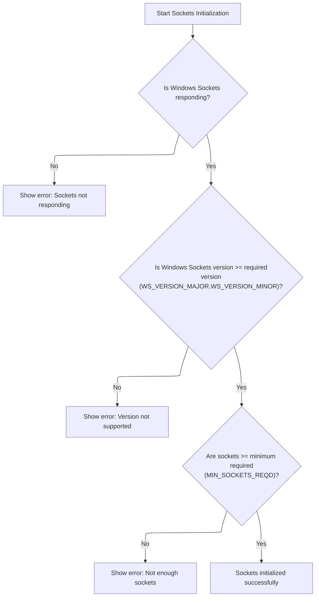
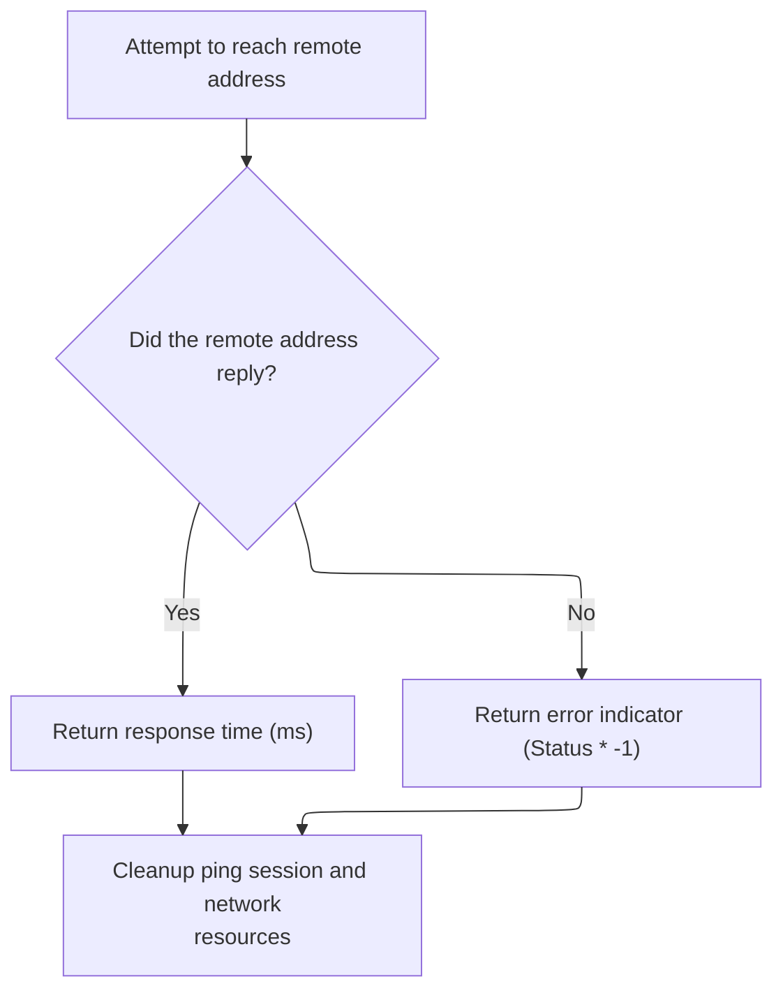

This document describes the flow for testing connectivity to a remote address. The application receives an IP address as input, prepares it for network operations, checks system compatibility, and sends a ping request. The result is either the response time in milliseconds or a negative error code, allowing the application to assess network reachability and performance.

# Preparing and Converting the Target Address

<SwmSnippet path="/warnet/Client/Module2.bas" line="172">

---

In <SwmToken path="warnet/Client/Module2.bas" pos="172:4:4" line-data="Public Function Ping(szAddress As String, ECHO As ICMP_ECHO_REPLY) As Long">`Ping`</SwmToken>, we set up the data to send and immediately convert the target address from a string to a numeric value using <SwmToken path="warnet/Client/Module2.bas" pos="180:5:5" line-data="   dwAddress = AddressStringToLong(szAddress)">`AddressStringToLong`</SwmToken>. This conversion is needed because the ICMP functions require the address in a numeric format, not as a string.

```visual basic
Public Function Ping(szAddress As String, ECHO As ICMP_ECHO_REPLY) As Long

   Dim hPort As Long
   Dim dwAddress As Long
   Dim sDataToSend As String
   Dim iOpt As Long
   
   sDataToSend = "Echo This"
   dwAddress = AddressStringToLong(szAddress)
```

---

</SwmSnippet>

<SwmSnippet path="/warnet/Client/Module2.bas" line="211">

---

<SwmToken path="warnet/Client/Module2.bas" pos="211:2:2" line-data="Function AddressStringToLong(ByVal tmp As String) As Long">`AddressStringToLong`</SwmToken> splits the dotted IP string into four segments, checks for exactly four, then converts and combines them into a single long integer in network byte order for use by the networking API.

```visual basic
Function AddressStringToLong(ByVal tmp As String) As Long

   Dim i As Integer
   Dim parts(1 To 4) As String
   
   i = 0
   
  'we have to extract each part of the
  '123.456.789.123 string, delimited by
  'a period
   While InStr(tmp, ".") > 0
      i = i + 1
      parts(i) = Mid(tmp, 1, InStr(tmp, ".") - 1)
      tmp = Mid(tmp, InStr(tmp, ".") + 1)
   Wend
   
   i = i + 1
   parts(i) = tmp
   
   If i <> 4 Then
      AddressStringToLong = 0
      Exit Function
   End If
   
  'build the long value out of the
  'hex of the extracted strings
   AddressStringToLong = Val("&H" & Right("00" & Hex(parts(4)), 2) & _
                         Right("00" & Hex(parts(3)), 2) & _
                         Right("00" & Hex(parts(2)), 2) & _
                         Right("00" & Hex(parts(1)), 2))
   
End Function
```

---

</SwmSnippet>

<SwmSnippet path="/warnet/Client/Module2.bas" line="181">

---

Back in <SwmToken path="warnet/Client/Module2.bas" pos="172:4:4" line-data="Public Function Ping(szAddress As String, ECHO As ICMP_ECHO_REPLY) As Long">`Ping`</SwmToken>, after converting the address, we call <SwmToken path="warnet/Client/Module2.bas" pos="182:3:3" line-data="   Call SocketsInitialize">`SocketsInitialize`</SwmToken> to make sure the Windows sockets subsystem is ready before creating the ICMP handle and sending the echo request.

```visual basic
   
   Call SocketsInitialize
```

---

</SwmSnippet>

## Checking Socket API Version and Capabilities



<SwmSnippet path="/warnet/Client/Module2.bas" line="262">

---

In <SwmToken path="warnet/Client/Module2.bas" pos="262:4:4" line-data="Public Function SocketsInitialize() As Boolean">`SocketsInitialize`</SwmToken>, we start by initializing the Windows Sockets API and immediately check if the version returned is high enough. <SwmToken path="warnet/Client/Module2.bas" pos="277:3:3" line-data="    If LoByte(WSAD.wVersion) &lt; WS_VERSION_MAJOR Or _">`LoByte`</SwmToken> is called next to extract the major version from the version number for this comparison.

```visual basic
Public Function SocketsInitialize() As Boolean

    Dim WSAD As WSADATA
    Dim X As Integer
    Dim szLoByte As String, szHiByte As String, szBuf As String
    
    X = WSAStartup(WS_VERSION_REQD, WSAD)
    
    If X <> 0 Then
        MsgBox "Windows Sockets for 32 bit Windows " & _
               "environments is not successfully responding."
        SocketsInitialize = False
        Exit Function
    End If
    
    If LoByte(WSAD.wVersion) < WS_VERSION_MAJOR Or _
       (LoByte(WSAD.wVersion) = WS_VERSION_MAJOR And _
```

---

</SwmSnippet>

<SwmSnippet path="/warnet/Client/Module2.bas" line="165">

---

<SwmToken path="warnet/Client/Module2.bas" pos="165:4:4" line-data="Public Function LoByte(ByVal wParam As Integer)">`LoByte`</SwmToken> pulls out the lower 8 bits from the version number, letting us check the major version of the Windows Sockets API.

```visual basic
Public Function LoByte(ByVal wParam As Integer)

    LoByte = wParam And &HFF&

End Function
```

---

</SwmSnippet>

<SwmSnippet path="/warnet/Client/Module2.bas" line="279">

---

Back in <SwmToken path="warnet/Client/Module2.bas" pos="182:3:3" line-data="   Call SocketsInitialize">`SocketsInitialize`</SwmToken>, after checking the major version with <SwmToken path="warnet/Client/Module2.bas" pos="165:4:4" line-data="Public Function LoByte(ByVal wParam As Integer)">`LoByte`</SwmToken>, we call <SwmToken path="warnet/Client/Module2.bas" pos="279:1:1" line-data="        HiByte(WSAD.wVersion) &lt; WS_VERSION_MINOR) Then">`HiByte`</SwmToken> to get the minor version for a complete version check.

```visual basic
        HiByte(WSAD.wVersion) < WS_VERSION_MINOR) Then
        
        szHiByte = Trim$(Str$(HiByte(WSAD.wVersion)))
```

---

</SwmSnippet>

<SwmSnippet path="/warnet/Client/Module2.bas" line="158">

---

<SwmToken path="warnet/Client/Module2.bas" pos="158:4:4" line-data="Public Function HiByte(ByVal wParam As Integer)">`HiByte`</SwmToken> extracts the upper 8 bits from the version number, giving us the minor version for the compatibility check.

```visual basic
Public Function HiByte(ByVal wParam As Integer)

    HiByte = wParam \ &H100 And &HFF&

End Function
```

---

</SwmSnippet>

<SwmSnippet path="/warnet/Client/Module2.bas" line="282">

---

Back in <SwmToken path="warnet/Client/Module2.bas" pos="182:3:3" line-data="   Call SocketsInitialize">`SocketsInitialize`</SwmToken>, after getting the minor version with <SwmToken path="warnet/Client/Module2.bas" pos="158:4:4" line-data="Public Function HiByte(ByVal wParam As Integer)">`HiByte`</SwmToken>, we call <SwmToken path="warnet/Client/Module2.bas" pos="282:11:11" line-data="        szLoByte = Trim$(Str$(LoByte(WSAD.wVersion)))">`LoByte`</SwmToken> again to get the major version for the error message if the version check fails.

```visual basic
        szLoByte = Trim$(Str$(LoByte(WSAD.wVersion)))
```

---

</SwmSnippet>

<SwmSnippet path="/warnet/Client/Module2.bas" line="283">

---

Back in <SwmToken path="warnet/Client/Module2.bas" pos="287:1:1" line-data="        SocketsInitialize = False">`SocketsInitialize`</SwmToken>, after extracting both version numbers, we build an error message if the version is too low, or if there aren't enough sockets, and return False to prevent further network operations.

```visual basic
        szBuf = "Windows Sockets Version " & szLoByte & "." & szHiByte
        szBuf = szBuf & " is not supported by Windows " & _
                          "Sockets for 32 bit Windows environments."
        MsgBox szBuf, vbExclamation
        SocketsInitialize = False
        Exit Function
        
    End If
    
    If WSAD.wMaxSockets < MIN_SOCKETS_REQD Then
        szBuf = "This application requires a minimum of " & _
                 Trim$(Str$(MIN_SOCKETS_REQD)) & " supported sockets."
        MsgBox szBuf, vbExclamation
        SocketsInitialize = False
        Exit Function
    End If
    
    SocketsInitialize = True
        
End Function
```

---

</SwmSnippet>

## Sending the Echo Request and Cleaning Up



<SwmSnippet path="/warnet/Client/Module2.bas" line="183">

---

Back in <SwmToken path="warnet/Client/Module2.bas" pos="201:1:1" line-data="         Ping = ECHO.RoundTripTime">`Ping`</SwmToken>, after sending the ICMP echo and closing the handle, we call <SwmToken path="warnet/Client/Module2.bas" pos="206:3:3" line-data="   Call SocketsCleanup">`SocketsCleanup`</SwmToken> to release any resources used by the sockets subsystem.

```visual basic
   hPort = IcmpCreateFile()
   
   If IcmpSendEcho(hPort, _
                   dwAddress, _
                   sDataToSend, _
                   Len(sDataToSend), _
                   0, _
                   ECHO, _
                   Len(ECHO), _
                   PING_TIMEOUT) Then
   
        'the ping succeeded,
        '.Status will be 0
        '.RoundTripTime is the time in ms for
        '               the ping to complete,
        '.Data is the data returned (NULL terminated)
        '.Address is the Ip address that actually replied
        '.DataSize is the size of the string in .Data
         Ping = ECHO.RoundTripTime
   Else: Ping = ECHO.status * -1
   End If
                       
   Call IcmpCloseHandle(hPort)
   Call SocketsCleanup
```

---

</SwmSnippet>

<SwmSnippet path="/warnet/Client/Module2.bas" line="245">

---

<SwmToken path="warnet/Client/Module2.bas" pos="245:4:4" line-data="Public Function SocketsCleanup() As Boolean">`SocketsCleanup`</SwmToken> calls <SwmToken path="warnet/Client/Module2.bas" pos="249:5:5" line-data="    X = WSACleanup()">`WSACleanup`</SwmToken> to unload the Winsock DLL and free up any resources used for socket operations, showing an error if cleanup fails.

```visual basic
Public Function SocketsCleanup() As Boolean

    Dim X As Long
    
    X = WSACleanup()
    
    If X <> 0 Then
        MsgBox "Windows Sockets error " & Trim$(Str$(X)) & _
               " occurred in Cleanup.", vbExclamation
        SocketsCleanup = False
    Else
        SocketsCleanup = True
    End If
    
End Function
```

---

</SwmSnippet>

<SwmSnippet path="/warnet/Client/Module2.bas" line="207">

---

Finally, in <SwmToken path="warnet/Client/Module2.bas" pos="172:4:4" line-data="Public Function Ping(szAddress As String, ECHO As ICMP_ECHO_REPLY) As Long">`Ping`</SwmToken>, after cleaning up sockets, we return either the round-trip time or a negative error code, depending on whether the ICMP echo succeeded.

```visual basic
   
End Function
```

---

</SwmSnippet>

&nbsp;

*This is an auto-generated document by Swimm 🌊 and has not yet been verified by a human*

<SwmMeta version="3.0.0" repo-id="Z2l0aHViJTNBJTNBY3RzLVZCNi1Qcm9qZWN0cyUzQSUzQVN3aW1tLURlbW8=" repo-name="cts-VB6-Projects"><sup>Powered by [Swimm](https://app.swimm.io/)</sup></SwmMeta>
