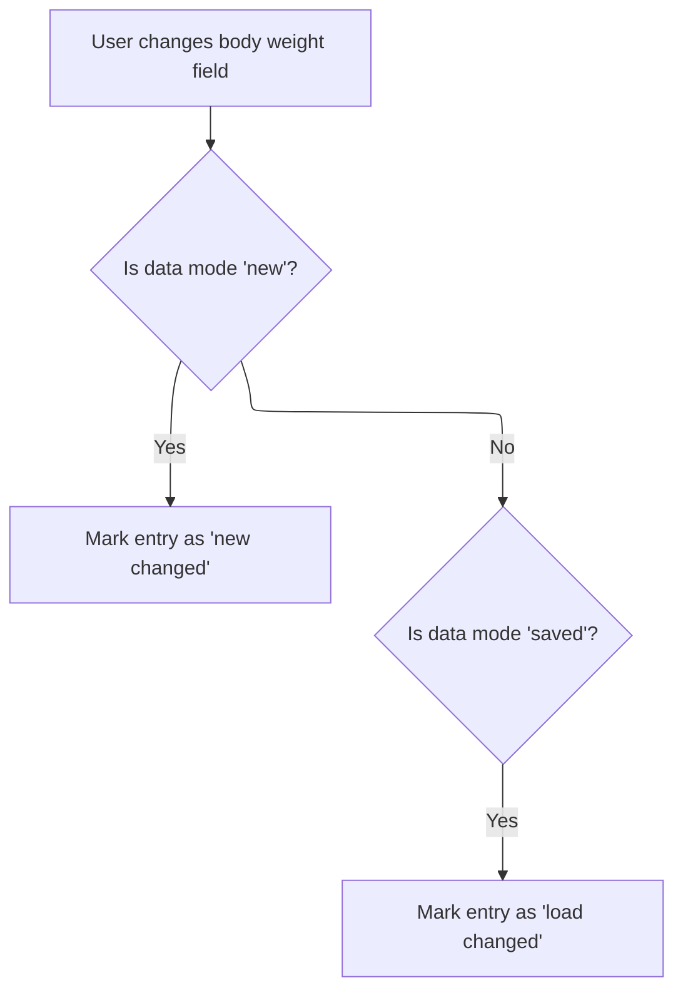

This document explains how the system tracks edits to the body weight field in the student entry form. When a user makes a change, the system updates the data state to reflect unsaved modifications, enabling prompts or warnings about unsaved data.

# Reacting to User Edits in Weight Field



<SwmSnippet path="/BK App/Form/frmentrysiswa.frm" line="2193">

---

Txtberatbadan_Change kicks off the flow whenever the user edits the weight field. It immediately calls <SwmToken path="BK App/Form/frmentrysiswa.frm" pos="2194:3:3" line-data="    Call ChangeData">`ChangeData`</SwmToken> to flag that the data has been modified, so the system can track unsaved changes from this point.

```visual basic
Private Sub txtberatbadan_Change()
    Call ChangeData
End Sub
```

---

</SwmSnippet>

<SwmSnippet path="/BK App/Form/frmentrysiswa.frm" line="1961">

---

<SwmToken path="BK App/Form/frmentrysiswa.frm" pos="1961:4:4" line-data="Private Sub ChangeData()">`ChangeData`</SwmToken> handles the state switch for <SwmToken path="BK App/Form/frmentrysiswa.frm" pos="1962:2:2" line-data="If DataMode = EN_NEW Then">`DataMode`</SwmToken>. It marks whether the user is editing a new or existing record, so the rest of the app can react accordingly (like enabling save or warning about unsaved changes).

```visual basic
Private Sub ChangeData()
If DataMode = EN_NEW Then
    DataMode = EN_NEW_CHANGED
ElseIf DataMode = EN_SAVED Then
    DataMode = EN_LOAD_CHANGED
End If
End Sub
```

---

</SwmSnippet>

&nbsp;

*This is an auto-generated document by Swimm 🌊 and has not yet been verified by a human*

<SwmMeta version="3.0.0" repo-id="Z2l0aHViJTNBJTNBY3RzLVZCNi1Qcm9qZWN0cyUzQSUzQVN3aW1tLURlbW8=" repo-name="cts-VB6-Projects"><sup>Powered by [Swimm](https://app.swimm.io/)</sup></SwmMeta>
