This document describes how staff can transfer a client session between computers. The system ensures all session data is moved, considers account and service types, updates the UI, and notifies the user when the transfer is finished.

# Transferring a Client Session Between Computers

```mermaid
%%{init: {"flowchart": {"defaultRenderer": "elk"}} }%%
flowchart TD
    node1["Start transfer process"] --> node2{"Are both computers selected?"}
    click node1 openCode "Internet Cafe Internet Cafe System/sErVere/frmTransfer.frm:129:131"
    node2 -->|"No"| node3["Show error: Please select computer"]
    click node2 openCode "Internet Cafe Internet Cafe System/sErVere/frmTransfer.frm:131:134"
    click node3 openCode "Internet Cafe Internet Cafe System/sErVere/frmTransfer.frm:132:133"
    node2 -->|"Yes"| node4["Begin session transfer"]
    click node4 openCode "Internet Cafe Internet Cafe System/sErVere/frmTransfer.frm:143:166"

    subgraph loop1["For each computer in system"]
        node4 --> node5{"Is this the source computer?"}
        click node5 openCode "Internet Cafe Internet Cafe System/sErVere/frmTransfer.frm:144:165"
        node5 -->|"Yes"| node6["Store session data and reset source"]
        click node6 openCode "Internet Cafe Internet Cafe System/sErVere/frmTransfer.frm:146:162"
        node6 --> node7["Send disconnect signal"]
        click node7 openCode "Internet Cafe Internet Cafe System/sErVere/frmTransfer.frm:163:164"
        node7 --> node8{"Is this the destination computer?"}
        click node8 openCode "Internet Cafe Internet Cafe System/sErVere/frmTransfer.frm:169:199"
        node8 -->|"Yes"| node9["Transfer session data to destination"]
        click node9 openCode "Internet Cafe Internet Cafe System/sErVere/frmTransfer.frm:171:183"
        node9 --> node10{"Account type?"}
        click node10 openCode "Internet Cafe Internet Cafe System/sErVere/frmTransfer.frm:194:197"
        node10 -->|"Open"| node11["Send Open session data"]
        click node11 openCode "Internet Cafe Internet Cafe System/sErVere/frmTransfer.frm:195:195"
        node10 -->|"Limited"| node12["Send Limited session data"]
        click node12 openCode "Internet Cafe Internet Cafe System/sErVere/frmTransfer.frm:197:197"
        node11 --> node13{"Service type?"}
        node12 --> node13
        click node13 openCode "Internet Cafe Internet Cafe System/sErVere/frmTransfer.frm:185:192"
        node13 -->|"Internet"| node14["Show Internet session"]
        click node14 openCode "Internet Cafe Internet Cafe System/sErVere/frmTransfer.frm:223:224"
        node13 -->|Games/Rental| node15["Show Games/Rental session"]
        click node15 openCode "Internet Cafe Internet Cafe System/sErVere/frmTransfer.frm:225:226"
        node14 --> node16["Update destination display and icon"]
        node15 --> node16
        click node16 openCode "Internet Cafe Internet Cafe System/sErVere/frmTransfer.frm:212:231"
        node16 --> node17["Enable destination computer"]
        click node17 openCode "Internet Cafe Internet Cafe System/sErVere/frmTransfer.frm:199:199"
        node8 -->|"No"| node4
        node5 -->|"No"| node4
    end

    node4 --> node18["Clear backup and grid data for source"]
    click node18 openCode "Internet Cafe Internet Cafe System/sErVere/frmTransfer.frm:204:207"
    node18 --> node19["Show transfer complete message"]
    click node19 openCode "Internet Cafe Internet Cafe System/sErVere/frmTransfer.frm:233:235"

classDef HeadingStyle fill:#777777,stroke:#333,stroke-width:2px;

%% Swimm:
%% %%{init: {"flowchart": {"defaultRenderer": "elk"}} }%%
%% flowchart TD
%%     node1["Start transfer process"] --> node2{"Are both computers selected?"}
%%     click node1 openCode "Internet Cafe <SwmPath>[Internet Cafe System/sErVere/frmTransfer.frm](Internet%20Cafe%20System/sErVere/frmTransfer.frm)</SwmPath>:129:131"
%%     node2 -->|"No"| node3["Show error: Please select computer"]
%%     click node2 openCode "Internet Cafe <SwmPath>[Internet Cafe System/sErVere/frmTransfer.frm](Internet%20Cafe%20System/sErVere/frmTransfer.frm)</SwmPath>:131:134"
%%     click node3 openCode "Internet Cafe <SwmPath>[Internet Cafe System/sErVere/frmTransfer.frm](Internet%20Cafe%20System/sErVere/frmTransfer.frm)</SwmPath>:132:133"
%%     node2 -->|"Yes"| node4["Begin session transfer"]
%%     click node4 openCode "Internet Cafe <SwmPath>[Internet Cafe System/sErVere/frmTransfer.frm](Internet%20Cafe%20System/sErVere/frmTransfer.frm)</SwmPath>:143:166"
%% 
%%     subgraph loop1["For each computer in system"]
%%         node4 --> node5{"Is this the source computer?"}
%%         click node5 openCode "Internet Cafe <SwmPath>[Internet Cafe System/sErVere/frmTransfer.frm](Internet%20Cafe%20System/sErVere/frmTransfer.frm)</SwmPath>:144:165"
%%         node5 -->|"Yes"| node6["Store session data and reset source"]
%%         click node6 openCode "Internet Cafe <SwmPath>[Internet Cafe System/sErVere/frmTransfer.frm](Internet%20Cafe%20System/sErVere/frmTransfer.frm)</SwmPath>:146:162"
%%         node6 --> node7["Send disconnect signal"]
%%         click node7 openCode "Internet Cafe <SwmPath>[Internet Cafe System/sErVere/frmTransfer.frm](Internet%20Cafe%20System/sErVere/frmTransfer.frm)</SwmPath>:163:164"
%%         node7 --> node8{"Is this the destination computer?"}
%%         click node8 openCode "Internet Cafe <SwmPath>[Internet Cafe System/sErVere/frmTransfer.frm](Internet%20Cafe%20System/sErVere/frmTransfer.frm)</SwmPath>:169:199"
%%         node8 -->|"Yes"| node9["Transfer session data to destination"]
%%         click node9 openCode "Internet Cafe <SwmPath>[Internet Cafe System/sErVere/frmTransfer.frm](Internet%20Cafe%20System/sErVere/frmTransfer.frm)</SwmPath>:171:183"
%%         node9 --> node10{"Account type?"}
%%         click node10 openCode "Internet Cafe <SwmPath>[Internet Cafe System/sErVere/frmTransfer.frm](Internet%20Cafe%20System/sErVere/frmTransfer.frm)</SwmPath>:194:197"
%%         node10 -->|"Open"| node11["Send Open session data"]
%%         click node11 openCode "Internet Cafe <SwmPath>[Internet Cafe System/sErVere/frmTransfer.frm](Internet%20Cafe%20System/sErVere/frmTransfer.frm)</SwmPath>:195:195"
%%         node10 -->|"Limited"| node12["Send Limited session data"]
%%         click node12 openCode "Internet Cafe <SwmPath>[Internet Cafe System/sErVere/frmTransfer.frm](Internet%20Cafe%20System/sErVere/frmTransfer.frm)</SwmPath>:197:197"
%%         node11 --> node13{"Service type?"}
%%         node12 --> node13
%%         click node13 openCode "Internet Cafe <SwmPath>[Internet Cafe System/sErVere/frmTransfer.frm](Internet%20Cafe%20System/sErVere/frmTransfer.frm)</SwmPath>:185:192"
%%         node13 -->|"Internet"| node14["Show Internet session"]
%%         click node14 openCode "Internet Cafe <SwmPath>[Internet Cafe System/sErVere/frmTransfer.frm](Internet%20Cafe%20System/sErVere/frmTransfer.frm)</SwmPath>:223:224"
%%         node13 -->|<SwmToken path="Internet Cafe System/sErVere/frmTransfer.frm" pos="225:4:6" line-data="  Else &#39;Games/Rental">`Games/Rental`</SwmToken>| node15["Show <SwmToken path="Internet Cafe System/sErVere/frmTransfer.frm" pos="225:4:6" line-data="  Else &#39;Games/Rental">`Games/Rental`</SwmToken> session"]
%%         click node15 openCode "Internet Cafe <SwmPath>[Internet Cafe System/sErVere/frmTransfer.frm](Internet%20Cafe%20System/sErVere/frmTransfer.frm)</SwmPath>:225:226"
%%         node14 --> node16["Update destination display and icon"]
%%         node15 --> node16
%%         click node16 openCode "Internet Cafe <SwmPath>[Internet Cafe System/sErVere/frmTransfer.frm](Internet%20Cafe%20System/sErVere/frmTransfer.frm)</SwmPath>:212:231"
%%         node16 --> node17["Enable destination computer"]
%%         click node17 openCode "Internet Cafe <SwmPath>[Internet Cafe System/sErVere/frmTransfer.frm](Internet%20Cafe%20System/sErVere/frmTransfer.frm)</SwmPath>:199:199"
%%         node8 -->|"No"| node4
%%         node5 -->|"No"| node4
%%     end
%% 
%%     node4 --> node18["Clear backup and grid data for source"]
%%     click node18 openCode "Internet Cafe <SwmPath>[Internet Cafe System/sErVere/frmTransfer.frm](Internet%20Cafe%20System/sErVere/frmTransfer.frm)</SwmPath>:204:207"
%%     node18 --> node19["Show transfer complete message"]
%%     click node19 openCode "Internet Cafe <SwmPath>[Internet Cafe System/sErVere/frmTransfer.frm](Internet%20Cafe%20System/sErVere/frmTransfer.frm)</SwmPath>:233:235"
%% 
%% classDef HeadingStyle fill:#777777,stroke:#333,stroke-width:2px;
```



<SwmSnippet path="/Internet Cafe System/sErVere/frmTransfer.frm" line="129">

---

In <SwmToken path="Internet Cafe System/sErVere/frmTransfer.frm" pos="129:4:4" line-data="Private Sub cmdTransfer_Click()">`cmdTransfer_Click`</SwmToken>, we check that both source and destination computers are selected, then loop through the clients to backup all session data from the source, reset its state, and send a disconnect signal. We then loop to the destination, restore the session data, determine the service type and rate, and send the correct data packet (using <SwmToken path="Internet Cafe System/sErVere/frmTransfer.frm" pos="195:16:16" line-data="        frmMain.Client(i).SendData &quot;OP&quot; &amp; AddSpace(tmpName, 30) &amp; strType &amp; AddSpace(Rte, 2) &amp; Trim(tmpStartLog) &amp; &quot;@&quot;">`AddSpace`</SwmToken> for formatting) to the client. The next step is to call <SwmToken path="Internet Cafe System/sErVere/frmTransfer.frm" pos="195:16:16" line-data="        frmMain.Client(i).SendData &quot;OP&quot; &amp; AddSpace(tmpName, 30) &amp; strType &amp; AddSpace(Rte, 2) &amp; Trim(tmpStartLog) &amp; &quot;@&quot;">`AddSpace`</SwmToken> from <SwmPath>[Internet Cafe System/sErVere/Module1.bas](Internet%20Cafe%20System/sErVere/Module1.bas)</SwmPath> to ensure the outgoing data string is formatted with the correct field widths for the client to parse.

```visual basic
Private Sub cmdTransfer_Click()
Dim i As Byte
  If lstFrom.Tag = "" Or lstTo.Tag = "" Then
    MsgBox "Please Select Computer!", vbCritical, "Transfer Invalid!"
    Exit Sub
  End If

Dim tmpNum As Byte
Dim strType
Dim Rte As String
  'Transfer Process
  
  Screen.MousePointer = vbHourglass
  
  For i = 1 To frmMain.Client.UBound - 1
    If frmMain.Client(i).ComputerNumber = Val(lstFrom.Tag) Then
    
      frmMain.Client(i).Enabled = False 'Stop the computation
      'Store Data on temporary
      tmpService = frmMain.Client(i).Service
      tmpPreviousElapse = frmMain.Client(i).PreviousElapse
      tmpCurrentElapse = frmMain.Client(i).CurrentElapse
      tmpStartLog = frmMain.Client(i).StartLog
      tmpEndLog = frmMain.Client(i).EndLog
      tmpName = frmMain.Client(i).CustomerName
      tmpPreviousAmount = frmMain.Client(i).PreviousAmount
      tmpCurrentAmount = frmMain.Client(i).CurrentAmount
      tmpAmount_Limited = frmMain.Client(i).Amount_Limited
      tmpInitialStart = frmMain.Client(i).InitialStart
      tmpConnected = frmMain.Client(i).Status
      tmpAccount = frmMain.Client(i).Account
      tmpExceeded = frmMain.Client(i).Exceeded
      
      frmMain.Client(i).Reset_Var
      frmMain.Client(i).Status = v_Connected
      frmMain.Client(i).SendData "ET1" & "@"
    End If
  Next i
  
  For i = 1 To frmMain.Client.UBound - 1
    If frmMain.Client(i).ComputerNumber = Val(lstTo.Tag) Then
      
      frmMain.Client(i).Service = tmpService
      frmMain.Client(i).PreviousElapse = tmpPreviousElapse
      frmMain.Client(i).CurrentElapse = tmpCurrentElapse
      frmMain.Client(i).StartLog = tmpStartLog
      frmMain.Client(i).EndLog = tmpEndLog
      frmMain.Client(i).CustomerName = tmpName
      frmMain.Client(i).PreviousAmount = tmpPreviousAmount
      frmMain.Client(i).CurrentAmount = tmpCurrentAmount
      frmMain.Client(i).Amount_Limited = tmpAmount_Limited
      frmMain.Client(i).InitialStart = tmpInitialStart
      frmMain.Client(i).Status = tmpConnected
      frmMain.Client(i).Account = tmpAccount
      frmMain.Client(i).Exceeded = tmpExceeded
    
      Select Case tmpService
      Case v_Internet
        strType = "Internet"
        Rte = Trim(Str(INTERNET_RATE))
      Case v_Rental_Games
        strType = "Gms/Rntl"
        Rte = Trim(Str(RENTAL_RATE))
      End Select
      
      If tmpAccount = v_Open Then 'Open
        frmMain.Client(i).SendData "OP" & AddSpace(tmpName, 30) & strType & AddSpace(Rte, 2) & Trim(tmpStartLog) & "@"
      Else 'Limited
        frmMain.Client(i).SendData "LT" & AddSpace(tmpName, 30) & strType & AddSpace(Trim(Str(tmpAmount_Limited)), 3) & AddSpace(Rte, 2) & Trim(tmpStartLog) & "@"
```

---

</SwmSnippet>

<SwmSnippet path="/Internet Cafe System/sErVere/Module1.bas" line="441">

---

<SwmToken path="Internet Cafe System/sErVere/Module1.bas" pos="441:4:4" line-data="Public Function AddSpace(expr As String, tot_lenght As Byte) As String">`AddSpace`</SwmToken> pads a string with spaces on the left so the total length matches what's expected by the client protocol. This keeps the data packets consistent and parseable on the receiving end.

```visual basic
Public Function AddSpace(expr As String, tot_lenght As Byte) As String
  AddSpace = Space(tot_lenght - Len(Trim(expr))) & expr
End Function
```

---

</SwmSnippet>

<SwmSnippet path="/Internet Cafe System/sErVere/frmTransfer.frm" line="198">

---

Back in <SwmToken path="Internet Cafe System/sErVere/frmTransfer.frm" pos="129:4:4" line-data="Private Sub cmdTransfer_Click()">`cmdTransfer_Click`</SwmToken>, after formatting and sending the session data, we call <SwmToken path="Internet Cafe System/sErVere/frmTransfer.frm" pos="204:1:1" line-data="  Remove_BackUp_Data CByte(lstFrom.Tag)">`Remove_BackUp_Data`</SwmToken> from <SwmPath>[Internet Cafe System/sErVere/Module1.bas](Internet%20Cafe%20System/sErVere/Module1.bas)</SwmPath> to clear any leftover backup info for the source computer. This prevents old session data from sticking around and causing issues if another transfer happens.

```visual basic
      End If
      frmMain.Client(i).Enabled = True
    End If
  Next i
    
  'Clear Backup Data
  Remove_BackUp_Data CByte(lstFrom.Tag)
```

---

</SwmSnippet>

<SwmSnippet path="/Internet Cafe System/sErVere/Module1.bas" line="452">

---

<SwmToken path="Internet Cafe System/sErVere/Module1.bas" pos="452:4:4" line-data="Public Sub Remove_BackUp_Data(ComputerNmbr As Byte)">`Remove_BackUp_Data`</SwmToken> finds the database record for the source computer and wipes all backup-related fields, making sure no old session data lingers for that machine.

```visual basic
Public Sub Remove_BackUp_Data(ComputerNmbr As Byte)
  SvrDbRst.MoveFirst
  SvrDbRst.Find "ComNum LIKE " & ComputerNmbr, 1, adSearchForward
  
  SvrDbRst!Name = Null
  SvrDbRst!StartLog = Null
  SvrDbRst!Elapse = 0
  SvrDbRst!Amt = 0
  SvrDbRst!Account = 0
  SvrDbRst!Service = 0
  SvrDbRst!AmtLimited = 0
  SvrDbRst!Unlock = False
  SvrDbRst.Update
End Sub
```

---

</SwmSnippet>

<SwmSnippet path="/Internet Cafe System/sErVere/frmTransfer.frm" line="205">

---

Back in <SwmToken path="Internet Cafe System/sErVere/frmTransfer.frm" pos="129:4:4" line-data="Private Sub cmdTransfer_Click()">`cmdTransfer_Click`</SwmToken>, after clearing backup data, we call <SwmToken path="Internet Cafe System/sErVere/frmTransfer.frm" pos="207:1:1" line-data="  Remove_Grid_Data CByte(lstFrom.Tag)">`Remove_Grid_Data`</SwmToken> from <SwmPath>[Internet Cafe System/sErVere/Module1.bas](Internet%20Cafe%20System/sErVere/Module1.bas)</SwmPath> to wipe the UI grid for the source computer. This keeps the display accurate and avoids showing old session info.

```visual basic
    
  'Clear Data Grid
  Remove_Grid_Data CByte(lstFrom.Tag)
```

---

</SwmSnippet>

<SwmSnippet path="/Internet Cafe System/sErVere/Module1.bas" line="467">

---

<SwmToken path="Internet Cafe System/sErVere/Module1.bas" pos="467:4:4" line-data="Public Sub Remove_Grid_Data(ComputerNmbr As Byte)">`Remove_Grid_Data`</SwmToken> loops through the grid subitems for the source computer and blanks them out, so the UI doesn't show any leftover session details.

```visual basic
Public Sub Remove_Grid_Data(ComputerNmbr As Byte)
Dim Ctr As Byte
  'Clear Data Grid
  For Ctr = 1 To 7
    frmMain.lvMain.ListItems(ComputerNmbr).ListSubItems(Ctr).Text = ""
  Next Ctr
End Sub
```

---

</SwmSnippet>

<SwmSnippet path="/Internet Cafe System/sErVere/frmTransfer.frm" line="208">

---

Finally, back in <SwmToken path="Internet Cafe System/sErVere/frmTransfer.frm" pos="129:4:4" line-data="Private Sub cmdTransfer_Click()">`cmdTransfer_Click`</SwmToken>, after clearing backup and grid data, we update the UI to show the session on the destination computer, set the correct status icons, reset the mouse pointer, and notify the user that the transfer is done. This keeps everything in sync visually and operationally.

```visual basic
  
  'Show Data in DataGrid
  tmpNum = Val(lstTo.Tag)
  
  frmMain.lvMain.ListItems(tmpNum).ListSubItems(1).Text = tmpName
  frmMain.lvMain.ListItems(tmpNum).ListSubItems(4).Text = FormatDateTime(tmpStartLog, vbLongTime)
  If tmpAccount = False Then 'Limited
    frmMain.lvMain.ListItems(tmpNum).ListSubItems(5).Text = FormatDateTime(tmpEndLog, vbLongTime)
    frmMain.lvMain.ListItems(tmpNum).ListSubItems(2).Text = "LIMITED"
    frmMain.lvMain.ListItems(tmpNum).ListSubItems(7).Text = tmpAmount_Limited
  Else 'Open
    frmMain.lvMain.ListItems(tmpNum).ListSubItems(2).Text = "OPEN"
    frmMain.lvMain.ListItems(tmpNum).ListSubItems(7).Text = tmpPreviousAmount + tmpCurrentAmount
  End If
  
  If tmpService = v_Internet Then 'Internet
    frmMain.lvMain.ListItems(tmpNum).ListSubItems(3).Text = "Internet"
  Else 'Games/Rental
    frmMain.lvMain.ListItems(tmpNum).ListSubItems(3).Text = "Gms/Rntl"
  End If
  
  'Change Light Color
  frmMain.lvMain.ListItems(Val(lstFrom.Tag)).SmallIcon = 2
  frmMain.lvMain.ListItems(Val(lstTo.Tag)).SmallIcon = 3
  
  Screen.MousePointer = vbNormal
  MsgBox "Transfer Complete"
  Unload Me
End Sub
```

---

</SwmSnippet>

&nbsp;

*This is an auto-generated document by Swimm 🌊 and has not yet been verified by a human*

<SwmMeta version="3.0.0" repo-id="Z2l0aHViJTNBJTNBY3RzLVZCNi1Qcm9qZWN0cyUzQSUzQVN3aW1tLURlbW8=" repo-name="cts-VB6-Projects"><sup>Powered by [Swimm](https://app.swimm.io/)</sup></SwmMeta>
