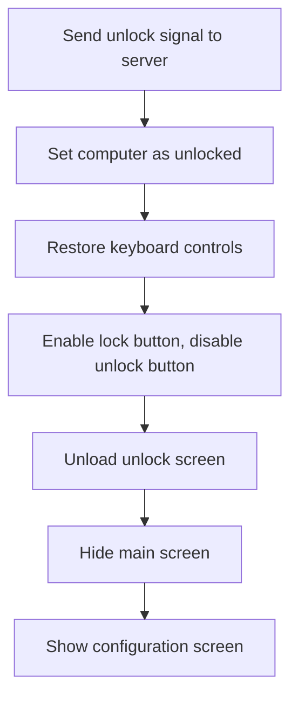

This document describes how users can unlock a client computer and regain access to controls in the Internet Cafe System. When the unlock action is triggered, the system communicates with the server, updates the locked state, restores keyboard controls, and transitions the interface to allow further configuration.

# Unlocking the Client and Restoring Controls



<SwmSnippet path="/Internet Cafe System/cLiEnTe/frmConfig.frm" line="244">

---

CmdUnlock_Click kicks off the unlock process: it sends an unlock signal to the server, updates the local Locked state, re-enables Ctrl+Alt+Del, and swaps the enabled state of the lock/unlock buttons. The form transitions (unload/hide/show) refresh the UI to reflect the unlocked state. We call into <SwmPath>[Internet Cafe System/cLiEnTe/Module1.bas](Internet%20Cafe%20System/cLiEnTe/Module1.bas)</SwmPath> next to actually re-enable Ctrl+Alt+Del at the OS level.

```visual basic
Private Sub cmdUnlock_Click()
On Error Resume Next
  frmMain.Sucket.SendData "UL" 'sends unlock signal to server
  Locked = False
  BlockCtrl_Alt_Del False
  cmdLock.Enabled = True
  cmdUnlock.Enabled = False
  Unload Me
  frmMain.Hide
  frmConfig.Show
End Sub
```

---

</SwmSnippet>

<SwmSnippet path="/Internet Cafe System/cLiEnTe/Module1.bas" line="88">

---

<SwmToken path="Internet Cafe System/cLiEnTe/Module1.bas" pos="88:2:2" line-data="Sub BlockCtrl_Alt_Del(bDisabled As Boolean)">`BlockCtrl_Alt_Del`</SwmToken> handles toggling the Ctrl+Alt+Del key sequence by calling <SwmToken path="Internet Cafe System/cLiEnTe/Module1.bas" pos="90:5:5" line-data="  X = SystemParametersInfo(97, bDisabled, CStr(1), 0)">`SystemParametersInfo`</SwmToken> with action code 97. It uses the <SwmToken path="Internet Cafe System/cLiEnTe/Module1.bas" pos="88:4:4" line-data="Sub BlockCtrl_Alt_Del(bDisabled As Boolean)">`bDisabled`</SwmToken> flag to decide whether to block or unblock, but the use of <SwmToken path="Internet Cafe System/cLiEnTe/Module1.bas" pos="90:13:13" line-data="  X = SystemParametersInfo(97, bDisabled, CStr(1), 0)">`CStr`</SwmToken>(1) is a bit hacky and might not be robust everywhere.

```visual basic
Sub BlockCtrl_Alt_Del(bDisabled As Boolean)
  Dim X As Long
  X = SystemParametersInfo(97, bDisabled, CStr(1), 0)

End Sub
```

---

</SwmSnippet>

&nbsp;

*This is an auto-generated document by Swimm 🌊 and has not yet been verified by a human*

<SwmMeta version="3.0.0" repo-id="Z2l0aHViJTNBJTNBY3RzLVZCNi1Qcm9qZWN0cyUzQSUzQVN3aW1tLURlbW8=" repo-name="cts-VB6-Projects"><sup>Powered by [Swimm](https://app.swimm.io/)</sup></SwmMeta>
