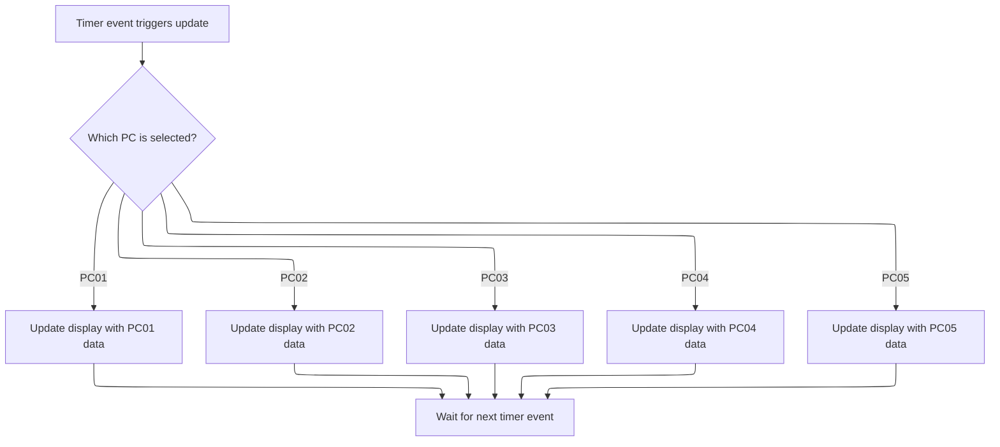

This document explains how the system keeps the display updated for the selected PC in a multi-PC management interface. When the timer event fires, the system checks which PC is currently selected and updates the display with the latest data for that PC.

# Dispatching Data Sync Based on PC Selection



<SwmSnippet path="/warnet/Server/moveclient.frm" line="419">

---

In <SwmToken path="warnet/Server/moveclient.frm" pos="419:4:4" line-data="Private Sub Timer1_Timer()">`Timer1_Timer`</SwmToken>, we check if <SwmToken path="warnet/Server/moveclient.frm" pos="420:2:4" line-data="If Combo1.Text = &quot;PC01&quot; Then SOURCE01">`Combo1.Text`</SwmToken> is <SwmToken path="warnet/Server/moveclient.frm" pos="420:9:9" line-data="If Combo1.Text = &quot;PC01&quot; Then SOURCE01">`PC01`</SwmToken> and, if so, call <SwmToken path="warnet/Server/moveclient.frm" pos="420:14:14" line-data="If Combo1.Text = &quot;PC01&quot; Then SOURCE01">`SOURCE01`</SwmToken>. This acts as a dispatcher, routing the flow to the handler that syncs data for <SwmToken path="warnet/Server/moveclient.frm" pos="420:9:9" line-data="If Combo1.Text = &quot;PC01&quot; Then SOURCE01">`PC01`</SwmToken>. Calling <SwmToken path="warnet/Server/moveclient.frm" pos="420:14:14" line-data="If Combo1.Text = &quot;PC01&quot; Then SOURCE01">`SOURCE01`</SwmToken> here ensures the UI for <SwmToken path="warnet/Server/moveclient.frm" pos="420:9:9" line-data="If Combo1.Text = &quot;PC01&quot; Then SOURCE01">`PC01`</SwmToken> is updated with the latest values from <SwmToken path="warnet/Server/moveclient.frm" pos="429:6:6" line-data="ATX01.Text = Form1.ETX01.Text">`Form1`</SwmToken>.

```visual basic
Private Sub Timer1_Timer()
If Combo1.Text = "PC01" Then SOURCE01
```

---

</SwmSnippet>

<SwmSnippet path="/warnet/Server/moveclient.frm" line="478">

---

<SwmToken path="warnet/Server/moveclient.frm" pos="478:4:4" line-data="Private Sub SOURCE01()">`SOURCE01`</SwmToken> copies the text values from <SwmToken path="warnet/Server/moveclient.frm" pos="480:6:6" line-data="ATX01.Text = Form1.ATX01.Text">`Form1`</SwmToken>'s ATX controls to the current form's ATX controls for <SwmToken path="warnet/Server/moveclient.frm" pos="479:2:2" line-data="&#39;---PC01">`PC01`</SwmToken>. Only the relevant fields for <SwmToken path="warnet/Server/moveclient.frm" pos="479:2:2" line-data="&#39;---PC01">`PC01`</SwmToken> are updated, keeping the UI in sync with <SwmToken path="warnet/Server/moveclient.frm" pos="480:6:6" line-data="ATX01.Text = Form1.ATX01.Text">`Form1`</SwmToken>.

```visual basic
Private Sub SOURCE01()
'---PC01
ATX01.Text = Form1.ATX01.Text
ATX02.Text = Form1.ATX02.Text
ATX03.Text = Form1.ATX03.Text
ATX04.Text = Form1.ATX04.Text
ATX05.Text = Form1.ATX05.Text
ATX06.Text = Form1.ATX06.Text
ATX07.Text = Form1.ATX07.Text
ATX09.Text = Form1.ATX09.Text
ATX11.Text = Form1.ATX11.Text
End Sub
```

---

</SwmSnippet>

<SwmSnippet path="/warnet/Server/moveclient.frm" line="421">

---

Back in <SwmToken path="warnet/Server/moveclient.frm" pos="419:4:4" line-data="Private Sub Timer1_Timer()">`Timer1_Timer`</SwmToken>, after handling <SwmToken path="warnet/Server/moveclient.frm" pos="420:9:9" line-data="If Combo1.Text = &quot;PC01&quot; Then SOURCE01">`PC01`</SwmToken>, we check if <SwmToken path="warnet/Server/moveclient.frm" pos="421:2:4" line-data="If Combo1.Text = &quot;PC02&quot; Then SOURCE02">`Combo1.Text`</SwmToken> is <SwmToken path="warnet/Server/moveclient.frm" pos="421:9:9" line-data="If Combo1.Text = &quot;PC02&quot; Then SOURCE02">`PC02`</SwmToken> and call <SwmToken path="warnet/Server/moveclient.frm" pos="421:14:14" line-data="If Combo1.Text = &quot;PC02&quot; Then SOURCE02">`SOURCE02`</SwmToken> if so. This keeps the dispatcher logic consistent

```visual basic
If Combo1.Text = "PC02" Then SOURCE02
```

---

</SwmSnippet>

<SwmSnippet path="/warnet/Server/moveclient.frm" line="465">

---

<SwmToken path="warnet/Server/moveclient.frm" pos="465:4:4" line-data="Private Sub SOURCE02()">`SOURCE02`</SwmToken> updates the current form's ATX controls with values from <SwmToken path="warnet/Server/moveclient.frm" pos="467:6:6" line-data="ATX01.Text = Form1.BTX01.Text">`Form1`</SwmToken>'s BTX controls, syncing the UI for <SwmToken path="warnet/Server/moveclient.frm" pos="466:2:2" line-data="&#39;---PC02">`PC02`</SwmToken>. Each PC uses its own set of source controls to keep data isolated.

```visual basic
Private Sub SOURCE02()
'---PC02
ATX01.Text = Form1.BTX01.Text
ATX02.Text = Form1.BTX02.Text
ATX03.Text = Form1.BTX03.Text
ATX04.Text = Form1.BTX04.Text
ATX05.Text = Form1.BTX05.Text
ATX06.Text = Form1.BTX06.Text
ATX07.Text = Form1.BTX07.Text
ATX09.Text = Form1.BTX09.Text
ATX11.Text = Form1.BTX11.Text
End Sub
```

---

</SwmSnippet>

<SwmSnippet path="/warnet/Server/moveclient.frm" line="422">

---

Back in <SwmToken path="warnet/Server/moveclient.frm" pos="419:4:4" line-data="Private Sub Timer1_Timer()">`Timer1_Timer`</SwmToken>, after updating for <SwmToken path="warnet/Server/moveclient.frm" pos="421:9:9" line-data="If Combo1.Text = &quot;PC02&quot; Then SOURCE02">`PC02`</SwmToken>, we check if <SwmToken path="warnet/Server/moveclient.frm" pos="422:2:4" line-data="If Combo1.Text = &quot;PC03&quot; Then SOURCE03">`Combo1.Text`</SwmToken> is <SwmToken path="warnet/Server/moveclient.frm" pos="422:9:9" line-data="If Combo1.Text = &quot;PC03&quot; Then SOURCE03">`PC03`</SwmToken> and call <SwmToken path="warnet/Server/moveclient.frm" pos="422:14:14" line-data="If Combo1.Text = &quot;PC03&quot; Then SOURCE03">`SOURCE03`</SwmToken>. This keeps the dispatcher logic straightforward, mapping each PC selection to its handler.

```visual basic
If Combo1.Text = "PC03" Then SOURCE03
```

---

</SwmSnippet>

<SwmSnippet path="/warnet/Server/moveclient.frm" line="453">

---

<SwmToken path="warnet/Server/moveclient.frm" pos="453:4:4" line-data="Private Sub SOURCE03()">`SOURCE03`</SwmToken> syncs the current form's ATX controls with <SwmToken path="warnet/Server/moveclient.frm" pos="455:6:6" line-data="ATX01.Text = Form1.CTX01.Text">`Form1`</SwmToken>'s CTX controls for <SwmToken path="warnet/Server/moveclient.frm" pos="454:2:2" line-data="&#39;---PC03">`PC03`</SwmToken>. Each PC uses a unique set of source controls to avoid data overlap.

```visual basic
Private Sub SOURCE03()
'---PC03
ATX01.Text = Form1.CTX01.Text
ATX02.Text = Form1.CTX02.Text
ATX03.Text = Form1.CTX03.Text
ATX04.Text = Form1.CTX04.Text
ATX05.Text = Form1.CTX05.Text
ATX06.Text = Form1.CTX06.Text
ATX07.Text = Form1.CTX07.Text
ATX09.Text = Form1.CTX09.Text
ATX11.Text = Form1.CTX11.Text
End Sub
```

---

</SwmSnippet>

<SwmSnippet path="/warnet/Server/moveclient.frm" line="423">

---

Back in <SwmToken path="warnet/Server/moveclient.frm" pos="419:4:4" line-data="Private Sub Timer1_Timer()">`Timer1_Timer`</SwmToken>, after handling <SwmToken path="warnet/Server/moveclient.frm" pos="422:9:9" line-data="If Combo1.Text = &quot;PC03&quot; Then SOURCE03">`PC03`</SwmToken>, we check if <SwmToken path="warnet/Server/moveclient.frm" pos="423:2:4" line-data="If Combo1.Text = &quot;PC04&quot; Then SOURCE04">`Combo1.Text`</SwmToken> is <SwmToken path="warnet/Server/moveclient.frm" pos="423:9:9" line-data="If Combo1.Text = &quot;PC04&quot; Then SOURCE04">`PC04`</SwmToken> and call <SwmToken path="warnet/Server/moveclient.frm" pos="423:14:14" line-data="If Combo1.Text = &quot;PC04&quot; Then SOURCE04">`SOURCE04`</SwmToken>. This keeps the dispatcher logic uniform

```visual basic
If Combo1.Text = "PC04" Then SOURCE04
```

---

</SwmSnippet>

<SwmSnippet path="/warnet/Server/moveclient.frm" line="440">

---

<SwmToken path="warnet/Server/moveclient.frm" pos="440:4:4" line-data="Private Sub SOURCE04()">`SOURCE04`</SwmToken> copies text from <SwmToken path="warnet/Server/moveclient.frm" pos="442:6:6" line-data="ATX01.Text = Form1.DTX01.Text">`Form1`</SwmToken>'s DTX controls to the current form's ATX controls for <SwmToken path="warnet/Server/moveclient.frm" pos="441:2:2" line-data="&#39;---PC04">`PC04`</SwmToken>, skipping DTX08 and DTX10. Only the necessary fields are updated for this PC.

```visual basic
Private Sub SOURCE04()
'---PC04
ATX01.Text = Form1.DTX01.Text
ATX02.Text = Form1.DTX02.Text
ATX03.Text = Form1.DTX03.Text
ATX04.Text = Form1.DTX04.Text
ATX05.Text = Form1.DTX05.Text
ATX06.Text = Form1.DTX06.Text
ATX07.Text = Form1.DTX07.Text
ATX09.Text = Form1.DTX09.Text
ATX11.Text = Form1.DTX11.Text
End Sub
```

---

</SwmSnippet>

<SwmSnippet path="/warnet/Server/moveclient.frm" line="424">

---

Back in <SwmToken path="warnet/Server/moveclient.frm" pos="419:4:4" line-data="Private Sub Timer1_Timer()">`Timer1_Timer`</SwmToken>, after handling <SwmToken path="warnet/Server/moveclient.frm" pos="423:9:9" line-data="If Combo1.Text = &quot;PC04&quot; Then SOURCE04">`PC04`</SwmToken>, we check if <SwmToken path="warnet/Server/moveclient.frm" pos="424:2:4" line-data="If Combo1.Text = &quot;PC05&quot; Then SOURCE05">`Combo1.Text`</SwmToken> is <SwmToken path="warnet/Server/moveclient.frm" pos="424:9:9" line-data="If Combo1.Text = &quot;PC05&quot; Then SOURCE05">`PC05`</SwmToken> and call <SwmToken path="warnet/Server/moveclient.frm" pos="424:14:14" line-data="If Combo1.Text = &quot;PC05&quot; Then SOURCE05">`SOURCE05`</SwmToken>. This keeps the dispatcher logic extensible for more PCs, though it does add more branches.

```visual basic
If Combo1.Text = "PC05" Then SOURCE05
```

---

</SwmSnippet>

<SwmSnippet path="/warnet/Server/moveclient.frm" line="427">

---

<SwmToken path="warnet/Server/moveclient.frm" pos="427:4:4" line-data="Private Sub SOURCE05()">`SOURCE05`</SwmToken> syncs the current form's ATX controls with <SwmToken path="warnet/Server/moveclient.frm" pos="429:6:6" line-data="ATX01.Text = Form1.ETX01.Text">`Form1`</SwmToken>'s ETX controls for <SwmToken path="warnet/Server/moveclient.frm" pos="428:2:2" line-data="&#39;---PC05">`PC05`</SwmToken>. Each PC uses its own set of source controls to keep data isolated.

```visual basic
Private Sub SOURCE05()
'---PC05
ATX01.Text = Form1.ETX01.Text
ATX02.Text = Form1.ETX02.Text
ATX03.Text = Form1.ETX03.Text
ATX04.Text = Form1.ETX04.Text
ATX05.Text = Form1.ETX05.Text
ATX06.Text = Form1.ETX06.Text
ATX07.Text = Form1.ETX07.Text
ATX09.Text = Form1.ETX09.Text
ATX11.Text = Form1.ETX11.Text
End Sub
```

---

</SwmSnippet>

<SwmSnippet path="/warnet/Server/moveclient.frm" line="425">

---

Finally, <SwmToken path="warnet/Server/moveclient.frm" pos="419:4:4" line-data="Private Sub Timer1_Timer()">`Timer1_Timer`</SwmToken> ends after routing to the correct SOURCE handler based on <SwmToken path="warnet/Server/moveclient.frm" pos="420:2:4" line-data="If Combo1.Text = &quot;PC01&quot; Then SOURCE01">`Combo1.Text`</SwmToken>. No extra cleanup or logic is performed here; the dispatcher just exits.

```visual basic
End Sub
```

---

</SwmSnippet>

&nbsp;

*This is an auto-generated document by Swimm 🌊 and has not yet been verified by a human*

<SwmMeta version="3.0.0" repo-id="Z2l0aHViJTNBJTNBY3RzLVZCNi1Qcm9qZWN0cyUzQSUzQVN3aW1tLURlbW8=" repo-name="cts-VB6-Projects"><sup>Powered by [Swimm](https://app.swimm.io/)</sup></SwmMeta>
