This document describes how rate records are updated when a guest's stay duration changes. The system removes outdated rate records, recalculates guest composition for each day, and creates new records as needed to ensure accurate billing and occupancy tracking.

# Updating Rate Records on Stay Duration Change

```mermaid
%%{init: {"flowchart": {"defaultRenderer": "elk"}} }%%
flowchart TD
    node1["Days changed for guest stay"]
    click node1 openCode "HotelManagementSystem/Forms/frmCheckOut.frm:829:829"
    node1 --> node2{"Is number of adults specified?"}
    click node2 openCode "HotelManagementSystem/Forms/frmCheckOut.frm:838:839"
    node2 -->|"No"| node9["Exit"]
    click node9 openCode "HotelManagementSystem/Forms/frmCheckOut.frm:839:839"
    node2 -->|"Yes"| node3{"Are actual adults equal to minimum
required for room?"}
    click node3 openCode "HotelManagementSystem/Forms/frmCheckOut.frm:850:854"
    node3 -->|"Yes"| node4["Set extra adults to 0"]
    click node4 openCode "HotelManagementSystem/Forms/frmCheckOut.frm:851:852"
    node3 -->|"No"| node5["Calculate extra adults"]
    click node5 openCode "HotelManagementSystem/Forms/frmCheckOut.frm:853:854"
    node4 --> node6["Remove rate records after new check-out
date"]
    click node6 openCode "HotelManagementSystem/Forms/frmCheckOut.frm:842:844"
    node5 --> node6
    node6 --> node7["For each date in stay"]
    click node7 openCode "HotelManagementSystem/Forms/frmCheckOut.frm:859:876"
    
    subgraph loop1["For each date in stay"]
      node7 --> node10{"Does rate record exist for date?"}
      click node10 openCode "HotelManagementSystem/Forms/frmCheckOut.frm:860:862"
      node10 -->|"No"| node11["Create new rate record with correct
adults and children"]
      click node11 openCode "HotelManagementSystem/Forms/frmCheckOut.frm:863:872"
      node10 -->|"Yes"| node12["Skip to next date"]
      click node12 openCode "HotelManagementSystem/Forms/frmCheckOut.frm:862:862"
      node11 --> node13["Next date"]
      node12 --> node13
      node13 --> node7
    end
    node7 --> node14["Commit changes and finish"]
    click node14 openCode "HotelManagementSystem/Forms/frmCheckOut.frm:879:880"

classDef HeadingStyle fill:#777777,stroke:#333,stroke-width:2px;

%% Swimm:
%% %%{init: {"flowchart": {"defaultRenderer": "elk"}} }%%
%% flowchart TD
%%     node1["Days changed for guest stay"]
%%     click node1 openCode "<SwmPath>[HotelManagementSystem/Forms/frmCheckOut.frm](HotelManagementSystem/Forms/frmCheckOut.frm)</SwmPath>:829:829"
%%     node1 --> node2{"Is number of adults specified?"}
%%     click node2 openCode "<SwmPath>[HotelManagementSystem/Forms/frmCheckOut.frm](HotelManagementSystem/Forms/frmCheckOut.frm)</SwmPath>:838:839"
%%     node2 -->|"No"| node9["Exit"]
%%     click node9 openCode "<SwmPath>[HotelManagementSystem/Forms/frmCheckOut.frm](HotelManagementSystem/Forms/frmCheckOut.frm)</SwmPath>:839:839"
%%     node2 -->|"Yes"| node3{"Are actual adults equal to minimum
%% required for room?"}
%%     click node3 openCode "<SwmPath>[HotelManagementSystem/Forms/frmCheckOut.frm](HotelManagementSystem/Forms/frmCheckOut.frm)</SwmPath>:850:854"
%%     node3 -->|"Yes"| node4["Set extra adults to 0"]
%%     click node4 openCode "<SwmPath>[HotelManagementSystem/Forms/frmCheckOut.frm](HotelManagementSystem/Forms/frmCheckOut.frm)</SwmPath>:851:852"
%%     node3 -->|"No"| node5["Calculate extra adults"]
%%     click node5 openCode "<SwmPath>[HotelManagementSystem/Forms/frmCheckOut.frm](HotelManagementSystem/Forms/frmCheckOut.frm)</SwmPath>:853:854"
%%     node4 --> node6["Remove rate records after new check-out
%% date"]
%%     click node6 openCode "<SwmPath>[HotelManagementSystem/Forms/frmCheckOut.frm](HotelManagementSystem/Forms/frmCheckOut.frm)</SwmPath>:842:844"
%%     node5 --> node6
%%     node6 --> node7["For each date in stay"]
%%     click node7 openCode "<SwmPath>[HotelManagementSystem/Forms/frmCheckOut.frm](HotelManagementSystem/Forms/frmCheckOut.frm)</SwmPath>:859:876"
%%     
%%     subgraph loop1["For each date in stay"]
%%       node7 --> node10{"Does rate record exist for date?"}
%%       click node10 openCode "<SwmPath>[HotelManagementSystem/Forms/frmCheckOut.frm](HotelManagementSystem/Forms/frmCheckOut.frm)</SwmPath>:860:862"
%%       node10 -->|"No"| node11["Create new rate record with correct
%% adults and children"]
%%       click node11 openCode "<SwmPath>[HotelManagementSystem/Forms/frmCheckOut.frm](HotelManagementSystem/Forms/frmCheckOut.frm)</SwmPath>:863:872"
%%       node10 -->|"Yes"| node12["Skip to next date"]
%%       click node12 openCode "<SwmPath>[HotelManagementSystem/Forms/frmCheckOut.frm](HotelManagementSystem/Forms/frmCheckOut.frm)</SwmPath>:862:862"
%%       node11 --> node13["Next date"]
%%       node12 --> node13
%%       node13 --> node7
%%     end
%%     node7 --> node14["Commit changes and finish"]
%%     click node14 openCode "<SwmPath>[HotelManagementSystem/Forms/frmCheckOut.frm](HotelManagementSystem/Forms/frmCheckOut.frm)</SwmPath>:879:880"
%% 
%% classDef HeadingStyle fill:#777777,stroke:#333,stroke-width:2px;
```



<SwmSnippet path="/HotelManagementSystem/Forms/frmCheckOut.frm" line="829">

---

In <SwmToken path="HotelManagementSystem/Forms/frmCheckOut.frm" pos="829:4:4" line-data="Private Sub txtDays_Change()">`txtDays_Change`</SwmToken>, we start by removing any rate records for dates after the new checkout date minus one day, so the rate table doesn't have leftover entries from a previous, longer stay. Then, we fetch the minimum number of persons for the selected room rate from the database, which is needed to calculate any extra adult charges. The next step calls into <SwmPath>[HotelManagementSystem/Modules/modFunction.bas](HotelManagementSystem/Modules/modFunction.bas)</SwmPath> to get this minimum value.

```visual basic
Private Sub txtDays_Change()
On Error GoTo err
    
    Dim rsRatePerPeriod As New ADODB.Recordset
    Dim tmpDate As Date
    Dim minNoofPerson As Integer
    
    tmpDate = txtDateIn.Text
    
    If txtAdults.Tag = "" Then Exit Sub
    
    CN.BeginTrans
    
    CN.Execute "DELETE [Date] " & _
                "FROM [Rate Per Period] " & _
                "WHERE [Date]>#" & dtpDateOut - 1 & "#"

    Dim intAdults As Integer
    
    minNoofPerson = getValueAt("SELECT * FROM [Room Rates] WHERE RoomNumber = " & RoomNumber & " AND RateTypeID = " & dcRateType.BoundText, "NoofPerson")
```

---

</SwmSnippet>

<SwmSnippet path="/HotelManagementSystem/Modules/modFunction.bas" line="168">

---

<SwmToken path="HotelManagementSystem/Modules/modFunction.bas" pos="168:4:4" line-data="Public Function getValueAt(ByVal srcSQL As String, ByVal whichField As String) As String">`getValueAt`</SwmToken> runs the given SQL and pulls out a single field from the first result row. If nothing is found, it just returns an empty string. This is used to grab the minimum number of persons for the rate calculation.

```visual basic
Public Function getValueAt(ByVal srcSQL As String, ByVal whichField As String) As String
    Dim RS As New Recordset
    
    RS.CursorLocation = adUseClient
    RS.Open srcSQL, CN, adOpenStatic, adLockReadOnly
    If RS.RecordCount > 0 Then getValueAt = RS.Fields(whichField)
    
    Set RS = Nothing
End Function
```

---

</SwmSnippet>

<SwmSnippet path="/HotelManagementSystem/Forms/frmCheckOut.frm" line="849">

---

Back in <SwmToken path="HotelManagementSystem/Forms/frmCheckOut.frm" pos="829:4:4" line-data="Private Sub txtDays_Change()">`txtDays_Change`</SwmToken>, after getting the minimum person count, we figure out how many extra adults to charge for. Then, we loop through each date in the stay, checking if a rate record exists for that day. If not, we add a new one with all the relevant details, including calculated adults and children. The next calculation for children uses helpers from <SwmPath>[HotelManagementSystem/Modules/modFunction.bas](HotelManagementSystem/Modules/modFunction.bas)</SwmPath>.

```visual basic
    
    If txtAdults.Text = minNoofPerson Then
        intAdults = 0
    Else
        intAdults = CInt(txtAdults.Text) - minNoofPerson
    End If

    With rsRatePerPeriod
        .Open "SELECT * FROM [Rate Per Period] WHERE FolioNumber = '" & txtGuestName.Tag & "' ORDER BY [Date]", CN, adOpenStatic, adLockOptimistic

        Do Until tmpDate > dtpDateOut.Value - 1
            .Filter = "[Date] = #" & tmpDate & "#"
            
            If .RecordCount = 0 Then
                .AddNew
                
                .Fields("FolioNumber") = txtGuestName.Tag
                .Fields("Date") = tmpDate
                .Fields("RoomNumber") = txtRoomNumber.Text
                .Fields("RateTypeID") = dcRateType.BoundText
                .Fields("Rate") = txtRate.Text
                .Fields("Adults") = txtAdults.Tag * intAdults
                .Fields("Childrens") = toMoney(txtChildrens.Tag) * toNumber(txtChildrens.Text)
```

---

</SwmSnippet>

<SwmSnippet path="/HotelManagementSystem/Modules/modFunction.bas" line="216">

---

<SwmToken path="HotelManagementSystem/Modules/modFunction.bas" pos="216:4:4" line-data="Public Function toMoney(ByVal srcCurr As String) As String">`toMoney`</SwmToken> formats a currency string to two decimals with thousands separators. If the input is empty, it treats it as zero. Here, it's used to make sure the children's tag value is in a standard format before further calculation.

```visual basic
Public Function toMoney(ByVal srcCurr As String) As String
   toMoney = Format$(IIf(Trim(srcCurr) = "", 0, srcCurr), "#,##0.00")
End Function
```

---

</SwmSnippet>

<SwmSnippet path="/HotelManagementSystem/Forms/frmCheckOut.frm" line="871">

---

Back in <SwmToken path="HotelManagementSystem/Forms/frmCheckOut.frm" pos="829:4:4" line-data="Private Sub txtDays_Change()">`txtDays_Change`</SwmToken>, after formatting the children's tag as money, we convert it to a number using another helper. This makes sure the multiplication for the children's field is done with numeric values, not strings.

```visual basic
                .Fields("Childrens") = toMoney(txtChildrens.Tag) * toNumber(txtChildrens.Text)
```

---

</SwmSnippet>

<SwmSnippet path="/HotelManagementSystem/Modules/modFunction.bas" line="182">

---

<SwmToken path="HotelManagementSystem/Modules/modFunction.bas" pos="182:4:4" line-data="Public Function toNumber(ByVal srcCurrency As String, Optional RetZeroIfNegative As Boolean) As Double">`toNumber`</SwmToken> takes a currency string, strips out commas, and converts it to a double. If the optional flag is set, it forces values less than 1 to zero. Here, it's used to make sure the children's value is a proper number for the rate record.

```visual basic
Public Function toNumber(ByVal srcCurrency As String, Optional RetZeroIfNegative As Boolean) As Double
    If srcCurrency = "" Then
        toNumber = 0
    Else
        Dim retValue As Double
        If InStr(1, srcCurrency, ",") > 0 Then
            retValue = Val(Replace(srcCurrency, ",", "", , , vbTextCompare))
        Else
            retValue = Val(srcCurrency)
        End If
        If RetZeroIfNegative = True Then
            If retValue < 1 Then retValue = 0
        End If
        toNumber = retValue
        retValue = 0
    End If
End Function
```

---

</SwmSnippet>

<SwmSnippet path="/HotelManagementSystem/Forms/frmCheckOut.frm" line="872">

---

Back in <SwmToken path="HotelManagementSystem/Forms/frmCheckOut.frm" pos="887:10:10" line-data="    prompt_err err, Name, &quot;txtDays_Change&quot;">`txtDays_Change`</SwmToken>, after updating or adding all rate records, we commit the transaction. If anything fails, we roll back and call the error handler in <SwmPath>[HotelManagementSystem/Modules/modProcedure.bas](HotelManagementSystem/Modules/modProcedure.bas)</SwmPath> to show/log the error.

```visual basic
                
                .Update
            End If
            tmpDate = tmpDate + 1
        Loop
    End With
    
    CN.CommitTrans
    
    rsRatePerPeriod.Close

    Exit Sub

err:
    CN.RollbackTrans
    prompt_err err, Name, "txtDays_Change"
```

---

</SwmSnippet>

<SwmSnippet path="/HotelManagementSystem/Modules/modProcedure.bas" line="87">

---

<SwmToken path="HotelManagementSystem/Modules/modProcedure.bas" pos="87:4:4" line-data="Public Sub prompt_err(ByVal sError As ErrObject, ByVal ModuleName As String, ByVal OccurIn As String)">`prompt_err`</SwmToken> pops up a message box with error details and appends the error info to <SwmPath>[HotelManagementSystem/Error.log](HotelManagementSystem/Error.log)</SwmPath> in the app folder. This helps with both immediate feedback and later troubleshooting.

```visual basic
Public Sub prompt_err(ByVal sError As ErrObject, ByVal ModuleName As String, ByVal OccurIn As String)
    MsgBox "Error From: " & ModuleName & vbNewLine & _
           "Occur In: " & OccurIn & vbNewLine & _
           "Error Number: " & sError.Number & vbNewLine & _
           "Description: " & sError.Description, vbCritical, "Application Error"
    'Save the error log (The save error log will be display later on in the program)
    Open App.Path & "\Error.log" For Append As #1
        Print #1, Format(Date, "MMM-dd-yyyy") & "~~~~~" & Time & "~~~~~" & sError.Number & "~~~~~" & sError.Description & "~~~~~" & ModuleName & "~~~~~" & OccurIn
    Close #1
End Sub
```

---

</SwmSnippet>

<SwmSnippet path="/HotelManagementSystem/Forms/frmCheckOut.frm" line="888">

---

Finally, in <SwmToken path="HotelManagementSystem/Forms/frmCheckOut.frm" pos="829:4:4" line-data="Private Sub txtDays_Change()">`txtDays_Change`</SwmToken>, we reset the mouse pointer to default so the UI doesn't get stuck in a busy state, even if there was an error.

```visual basic
    Screen.MousePointer = vbDefault
End Sub
```

---

</SwmSnippet>

&nbsp;

*This is an auto-generated document by Swimm 🌊 and has not yet been verified by a human*

<SwmMeta version="3.0.0" repo-id="Z2l0aHViJTNBJTNBY3RzLVZCNi1Qcm9qZWN0cyUzQSUzQVN3aW1tLURlbW8=" repo-name="cts-VB6-Projects"><sup>Powered by [Swimm](https://app.swimm.io/)</sup></SwmMeta>
