This document describes how the system updates rate period records and recalculates charges when a guest changes the number of days for their stay. As part of the checkout process, this ensures that billing is accurate and reflects the new duration, with correct rates for adults and children.

# Updating Rate Periods and Handling Stay Changes

```mermaid
%%{init: {"flowchart": {"defaultRenderer": "elk"}} }%%
flowchart TD
    node1["Guest changes number of days for stay"]
    click node1 openCode "HotelManagementSystem/Forms/frmCheckOut.frm:829:830"
    node1 --> node2{"Is number of adults specified?"}
    click node2 openCode "HotelManagementSystem/Forms/frmCheckOut.frm:838:839"
    node2 -->|"No"| node9["Exit: Cannot update rates"]
    click node9 openCode "HotelManagementSystem/Forms/frmCheckOut.frm:839:839"
    node2 -->|"Yes"| node3{"Are adults equal to minimum required?"}
    click node3 openCode "HotelManagementSystem/Forms/frmCheckOut.frm:850:854"
    node3 -->|"Yes"| node4["Set extra adults to 0"]
    click node4 openCode "HotelManagementSystem/Forms/frmCheckOut.frm:851:852"
    node3 -->|"No"| node5["Set extra adults to (adults - minimum)"]
    click node5 openCode "HotelManagementSystem/Forms/frmCheckOut.frm:853:854"
    node4 --> node6["Update daily rates for stay"]
    node5 --> node6
    click node6 openCode "HotelManagementSystem/Forms/frmCheckOut.frm:856:877"
    
    subgraph loop1["For each day in stay"]
        node6 --> node7{"Does rate record exist for date?"}
        click node7 openCode "HotelManagementSystem/Forms/frmCheckOut.frm:862:863"
        node7 -->|"No"| node8["Add new rate record with updated adults, children, and rate"]
        click node8 openCode "HotelManagementSystem/Forms/frmCheckOut.frm:863:873"
        node7 -->|"Yes"| node11["Skip to next day"]
        click node11 openCode "HotelManagementSystem/Forms/frmCheckOut.frm:875:875"
        node8 --> node11
        node11 --> node12{"More days left?"}
        click node12 openCode "HotelManagementSystem/Forms/frmCheckOut.frm:875:876"
        node12 -->|"Yes"| node7
        node12 -->|"No"| node13["Finish updating rates"]
        click node13 openCode "HotelManagementSystem/Forms/frmCheckOut.frm:879:882"
    end
    node6 --> node13

classDef HeadingStyle fill:#777777,stroke:#333,stroke-width:2px;

%% Swimm:
%% %%{init: {"flowchart": {"defaultRenderer": "elk"}} }%%
%% flowchart TD
%%     node1["Guest changes number of days for stay"]
%%     click node1 openCode "<SwmPath>[HotelManagementSystem/Forms/frmCheckOut.frm](HotelManagementSystem/Forms/frmCheckOut.frm)</SwmPath>:829:830"
%%     node1 --> node2{"Is number of adults specified?"}
%%     click node2 openCode "<SwmPath>[HotelManagementSystem/Forms/frmCheckOut.frm](HotelManagementSystem/Forms/frmCheckOut.frm)</SwmPath>:838:839"
%%     node2 -->|"No"| node9["Exit: Cannot update rates"]
%%     click node9 openCode "<SwmPath>[HotelManagementSystem/Forms/frmCheckOut.frm](HotelManagementSystem/Forms/frmCheckOut.frm)</SwmPath>:839:839"
%%     node2 -->|"Yes"| node3{"Are adults equal to minimum required?"}
%%     click node3 openCode "<SwmPath>[HotelManagementSystem/Forms/frmCheckOut.frm](HotelManagementSystem/Forms/frmCheckOut.frm)</SwmPath>:850:854"
%%     node3 -->|"Yes"| node4["Set extra adults to 0"]
%%     click node4 openCode "<SwmPath>[HotelManagementSystem/Forms/frmCheckOut.frm](HotelManagementSystem/Forms/frmCheckOut.frm)</SwmPath>:851:852"
%%     node3 -->|"No"| node5["Set extra adults to (adults - minimum)"]
%%     click node5 openCode "<SwmPath>[HotelManagementSystem/Forms/frmCheckOut.frm](HotelManagementSystem/Forms/frmCheckOut.frm)</SwmPath>:853:854"
%%     node4 --> node6["Update daily rates for stay"]
%%     node5 --> node6
%%     click node6 openCode "<SwmPath>[HotelManagementSystem/Forms/frmCheckOut.frm](HotelManagementSystem/Forms/frmCheckOut.frm)</SwmPath>:856:877"
%%     
%%     subgraph loop1["For each day in stay"]
%%         node6 --> node7{"Does rate record exist for date?"}
%%         click node7 openCode "<SwmPath>[HotelManagementSystem/Forms/frmCheckOut.frm](HotelManagementSystem/Forms/frmCheckOut.frm)</SwmPath>:862:863"
%%         node7 -->|"No"| node8["Add new rate record with updated adults, children, and rate"]
%%         click node8 openCode "<SwmPath>[HotelManagementSystem/Forms/frmCheckOut.frm](HotelManagementSystem/Forms/frmCheckOut.frm)</SwmPath>:863:873"
%%         node7 -->|"Yes"| node11["Skip to next day"]
%%         click node11 openCode "<SwmPath>[HotelManagementSystem/Forms/frmCheckOut.frm](HotelManagementSystem/Forms/frmCheckOut.frm)</SwmPath>:875:875"
%%         node8 --> node11
%%         node11 --> node12{"More days left?"}
%%         click node12 openCode "<SwmPath>[HotelManagementSystem/Forms/frmCheckOut.frm](HotelManagementSystem/Forms/frmCheckOut.frm)</SwmPath>:875:876"
%%         node12 -->|"Yes"| node7
%%         node12 -->|"No"| node13["Finish updating rates"]
%%         click node13 openCode "<SwmPath>[HotelManagementSystem/Forms/frmCheckOut.frm](HotelManagementSystem/Forms/frmCheckOut.frm)</SwmPath>:879:882"
%%     end
%%     node6 --> node13
%% 
%% classDef HeadingStyle fill:#777777,stroke:#333,stroke-width:2px;
```



<SwmSnippet path="/HotelManagementSystem/Forms/frmCheckOut.frm" line="829">

---

In <SwmToken path="HotelManagementSystem/Forms/frmCheckOut.frm" pos="829:4:4" line-data="Private Sub txtDays_Change()">`txtDays_Change`</SwmToken>, we start by making sure the input is valid, then begin a transaction and clear out any rate period records that are after the new checkout date. This avoids stale or duplicate billing entries. Next, we need to know the minimum number of persons for the room rate, so we call into <SwmPath>[HotelManagementSystem/Modules/modFunction.bas](HotelManagementSystem/Modules/modFunction.bas)</SwmPath> to fetch that from the database. This info is needed to figure out if there are extra adults, which affects the rate calculation.

```visual basic
Private Sub txtDays_Change()
On Error GoTo err
    
    Dim rsRatePerPeriod As New ADODB.Recordset
    Dim tmpDate As Date
    Dim minNoofPerson As Integer
    
    tmpDate = txtDateIn.Text
    
    If txtAdults.Tag = "" Then Exit Sub
    
    CN.BeginTrans
    
    CN.Execute "DELETE [Date] " & _
                "FROM [Rate Per Period] " & _
                "WHERE [Date]>#" & dtpDateOut - 1 & "#"

    Dim intAdults As Integer
    
    minNoofPerson = getValueAt("SELECT * FROM [Room Rates] WHERE RoomNumber = " & RoomNumber & " AND RateTypeID = " & dcRateType.BoundText, "NoofPerson")
    
    If txtAdults.Text = minNoofPerson Then
        intAdults = 0
    Else
        intAdults = CInt(txtAdults.Text) - minNoofPerson
    End If

    With rsRatePerPeriod
        .Open "SELECT * FROM [Rate Per Period] WHERE FolioNumber = '" & txtGuestName.Tag & "' ORDER BY [Date]", CN, adOpenStatic, adLockOptimistic

        Do Until tmpDate > dtpDateOut.Value - 1
            .Filter = "[Date] = #" & tmpDate & "#"
            
            If .RecordCount = 0 Then
                .AddNew
                
                .Fields("FolioNumber") = txtGuestName.Tag
                .Fields("Date") = tmpDate
                .Fields("RoomNumber") = txtRoomNumber.Text
                .Fields("RateTypeID") = dcRateType.BoundText
                .Fields("Rate") = txtRate.Text
                .Fields("Adults") = txtAdults.Tag * intAdults
```

---

</SwmSnippet>

<SwmSnippet path="/HotelManagementSystem/Modules/modFunction.bas" line="168">

---

<SwmToken path="HotelManagementSystem/Modules/modFunction.bas" pos="168:4:4" line-data="Public Function getValueAt(ByVal srcSQL As String, ByVal whichField As String) As String">`getValueAt`</SwmToken> runs the given SQL, grabs the first field from the first record if it exists, and returns it as a string. This is used in <SwmToken path="HotelManagementSystem/Forms/frmCheckOut.frm" pos="829:4:4" line-data="Private Sub txtDays_Change()">`txtDays_Change`</SwmToken> to get the minimum number of persons for the rate calculation.

```visual basic
Public Function getValueAt(ByVal srcSQL As String, ByVal whichField As String) As String
    Dim RS As New Recordset
    
    RS.CursorLocation = adUseClient
    RS.Open srcSQL, CN, adOpenStatic, adLockReadOnly
    If RS.RecordCount > 0 Then getValueAt = RS.Fields(whichField)
    
    Set RS = Nothing
End Function
```

---

</SwmSnippet>

<SwmSnippet path="/HotelManagementSystem/Forms/frmCheckOut.frm" line="871">

---

Back in <SwmToken path="HotelManagementSystem/Forms/frmCheckOut.frm" pos="829:4:4" line-data="Private Sub txtDays_Change()">`txtDays_Change`</SwmToken>, after getting the minimum persons, we now need to calculate the children's charges. For that, we call into <SwmPath>[HotelManagementSystem/Modules/modFunction.bas](HotelManagementSystem/Modules/modFunction.bas)</SwmPath> again to format the rate and convert the count, so the billing entry is correct.

```visual basic
                .Fields("Childrens") = toMoney(txtChildrens.Tag) * toNumber(txtChildrens.Text)
```

---

</SwmSnippet>

<SwmSnippet path="/HotelManagementSystem/Modules/modFunction.bas" line="216">

---

<SwmToken path="HotelManagementSystem/Modules/modFunction.bas" pos="216:4:4" line-data="Public Function toMoney(ByVal srcCurr As String) As String">`toMoney`</SwmToken> just formats a string as a currency value, defaulting to zero if the input is empty. This keeps the rate values consistent for calculations and display.

```visual basic
Public Function toMoney(ByVal srcCurr As String) As String
   toMoney = Format$(IIf(Trim(srcCurr) = "", 0, srcCurr), "#,##0.00")
End Function
```

---

</SwmSnippet>

<SwmSnippet path="/HotelManagementSystem/Forms/frmCheckOut.frm" line="871">

---

Back in <SwmToken path="HotelManagementSystem/Forms/frmCheckOut.frm" pos="829:4:4" line-data="Private Sub txtDays_Change()">`txtDays_Change`</SwmToken>, we finish updating or adding rate period records for each date, making sure all charges are calculated right.

```visual basic
                .Fields("Childrens") = toMoney(txtChildrens.Tag) * toNumber(txtChildrens.Text)
                
                .Update
            End If
            tmpDate = tmpDate + 1
        Loop
    End With
    
    CN.CommitTrans
    
    rsRatePerPeriod.Close

    Exit Sub

err:
    CN.RollbackTrans
```

---

</SwmSnippet>

<SwmSnippet path="/HotelManagementSystem/Modules/modFunction.bas" line="182">

---

<SwmToken path="HotelManagementSystem/Modules/modFunction.bas" pos="182:4:4" line-data="Public Function toNumber(ByVal srcCurrency As String, Optional RetZeroIfNegative As Boolean) As Double">`toNumber`</SwmToken> converts a currency string (with or without commas) to a double. If you want, it can force negative or zero values to zero, which is handy for billing so you don't get weird negative charges.

```visual basic
Public Function toNumber(ByVal srcCurrency As String, Optional RetZeroIfNegative As Boolean) As Double
    If srcCurrency = "" Then
        toNumber = 0
    Else
        Dim retValue As Double
        If InStr(1, srcCurrency, ",") > 0 Then
            retValue = Val(Replace(srcCurrency, ",", "", , , vbTextCompare))
        Else
            retValue = Val(srcCurrency)
        End If
        If RetZeroIfNegative = True Then
            If retValue < 1 Then retValue = 0
        End If
        toNumber = retValue
        retValue = 0
    End If
End Function
```

---

</SwmSnippet>

<SwmSnippet path="/HotelManagementSystem/Forms/frmCheckOut.frm" line="887">

---

Back in <SwmToken path="HotelManagementSystem/Forms/frmCheckOut.frm" pos="887:10:10" line-data="    prompt_err err, Name, &quot;txtDays_Change&quot;">`txtDays_Change`</SwmToken>, if anything blows up, we call the error handler in <SwmPath>[HotelManagementSystem/Modules/modProcedure.bas](HotelManagementSystem/Modules/modProcedure.bas)</SwmPath>. This pops up a message for the user and logs the details for later troubleshooting.

```visual basic
    prompt_err err, Name, "txtDays_Change"
    Screen.MousePointer = vbDefault
End Sub
```

---

</SwmSnippet>

<SwmSnippet path="/HotelManagementSystem/Modules/modProcedure.bas" line="87">

---

<SwmToken path="HotelManagementSystem/Modules/modProcedure.bas" pos="87:4:4" line-data="Public Sub prompt_err(ByVal sError As ErrObject, ByVal ModuleName As String, ByVal OccurIn As String)">`prompt_err`</SwmToken> pops up a message box with the error details and writes everything to <SwmPath>[HotelManagementSystem/Error.log](HotelManagementSystem/Error.log)</SwmPath> in the app folder. This way, users get feedback and we have a record for debugging.

```visual basic
Public Sub prompt_err(ByVal sError As ErrObject, ByVal ModuleName As String, ByVal OccurIn As String)
    MsgBox "Error From: " & ModuleName & vbNewLine & _
           "Occur In: " & OccurIn & vbNewLine & _
           "Error Number: " & sError.Number & vbNewLine & _
           "Description: " & sError.Description, vbCritical, "Application Error"
    'Save the error log (The save error log will be display later on in the program)
    Open App.Path & "\Error.log" For Append As #1
        Print #1, Format(Date, "MMM-dd-yyyy") & "~~~~~" & Time & "~~~~~" & sError.Number & "~~~~~" & sError.Description & "~~~~~" & ModuleName & "~~~~~" & OccurIn
    Close #1
End Sub
```

---

</SwmSnippet>

&nbsp;

*This is an auto-generated document by Swimm 🌊 and has not yet been verified by a human*

<SwmMeta version="3.0.0" repo-id="Z2l0aHViJTNBJTNBY3RzLVZCNi1Qcm9qZWN0cyUzQSUzQVN3aW1tLURlbW8=" repo-name="cts-VB6-Projects"><sup>Powered by [Swimm](https://app.swimm.io/)</sup></SwmMeta>
