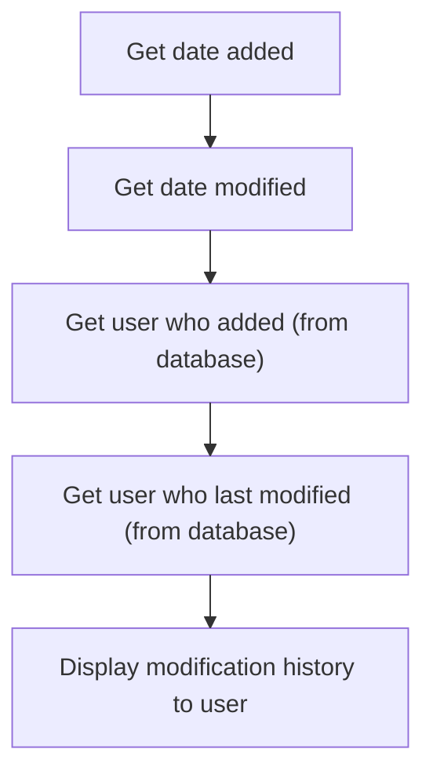

This document explains how users can view a record's modification history. The system retrieves and displays the creation and last modification dates, as well as the names of the users who performed these actions, in a message box for easy review.

# Showing Record Modification History



<SwmSnippet path="/HotelManagementSystem/Forms/frmRateType.frm" line="138">

---

CmdUsrHistory_Click starts the flow by grabbing the <SwmToken path="HotelManagementSystem/Forms/frmRateType.frm" pos="145:13:13" line-data="    tDate1 = Format$(RS.Fields(&quot;DateAdded&quot;), &quot;MMM-dd-yyyy HH:MM AMPM&quot;)">`DateAdded`</SwmToken> and <SwmToken path="HotelManagementSystem/Forms/frmRateType.frm" pos="146:13:13" line-data="    tDate2 = Format$(RS.Fields(&quot;DateModified&quot;), &quot;MMM-dd-yyyy HH:MM AMPM&quot;)">`DateModified`</SwmToken> fields from the current record, formatting them for readability, and then calling <SwmToken path="HotelManagementSystem/Forms/frmRateType.frm" pos="148:5:5" line-data="    tUser1 = getValueAt(&quot;SELECT PK,CompleteName FROM tbl_SM_Users WHERE PK = &quot; &amp; RS.Fields(&quot;AddedByFK&quot;), &quot;CompleteName&quot;)">`getValueAt`</SwmToken> to resolve the user names for who added and last modified the record. It builds a message with this info and pops it up for the user. We call <SwmToken path="HotelManagementSystem/Forms/frmRateType.frm" pos="148:5:5" line-data="    tUser1 = getValueAt(&quot;SELECT PK,CompleteName FROM tbl_SM_Users WHERE PK = &quot; &amp; RS.Fields(&quot;AddedByFK&quot;), &quot;CompleteName&quot;)">`getValueAt`</SwmToken> next because we need to translate the user foreign keys into actual names for display.

```visual basic
Private Sub cmdUsrHistory_Click()
    On Error Resume Next
    Dim tDate1 As String
    Dim tDate2 As String
    Dim tUser1 As String
    Dim tUser2 As String
    
    tDate1 = Format$(RS.Fields("DateAdded"), "MMM-dd-yyyy HH:MM AMPM")
    tDate2 = Format$(RS.Fields("DateModified"), "MMM-dd-yyyy HH:MM AMPM")
    
    tUser1 = getValueAt("SELECT PK,CompleteName FROM tbl_SM_Users WHERE PK = " & RS.Fields("AddedByFK"), "CompleteName")
    tUser2 = getValueAt("SELECT PK,CompleteName FROM tbl_SM_Users WHERE PK = " & RS.Fields("LastUserFK"), "CompleteName")
    
    MsgBox "Date Added: " & tDate1 & vbCrLf & _
           "Added By: " & tUser1 & vbCrLf & _
           "" & vbCrLf & _
           "Last Modified: " & tDate2 & vbCrLf & _
           "Modified By: " & tUser2, vbInformation, "Modification History"
           
    tDate1 = vbNullString
    tDate2 = vbNullString
    tUser1 = vbNullString
    tUser2 = vbNullString
End Sub
```

---

</SwmSnippet>

<SwmSnippet path="/HotelManagementSystem/Modules/modFunction.bas" line="168">

---

GetValueAt runs the SQL query, grabs the first record if there is one, and returns the requested field as a string. This is how we turn a user foreign key into a display name for the message box.

```visual basic
Public Function getValueAt(ByVal srcSQL As String, ByVal whichField As String) As String
    Dim RS As New Recordset
    
    RS.CursorLocation = adUseClient
    RS.Open srcSQL, CN, adOpenStatic, adLockReadOnly
    If RS.RecordCount > 0 Then getValueAt = RS.Fields(whichField)
    
    Set RS = Nothing
End Function
```

---

</SwmSnippet>

&nbsp;

*This is an auto-generated document by Swimm 🌊 and has not yet been verified by a human*

<SwmMeta version="3.0.0" repo-id="Z2l0aHViJTNBJTNBY3RzLVZCNi1Qcm9qZWN0cyUzQSUzQVN3aW1tLURlbW8=" repo-name="cts-VB6-Projects"><sup>Powered by [Swimm](https://app.swimm.io/)</sup></SwmMeta>
